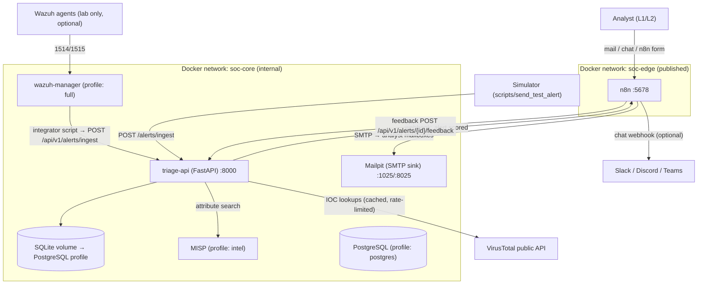
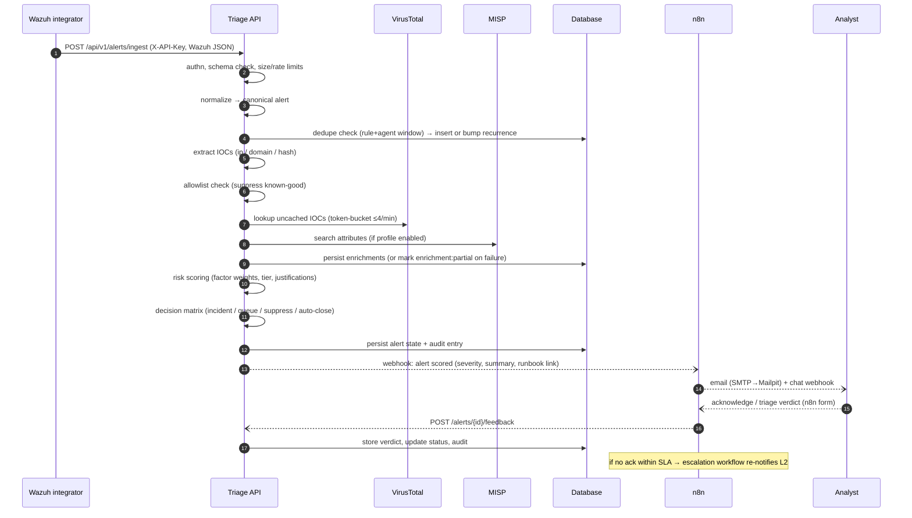
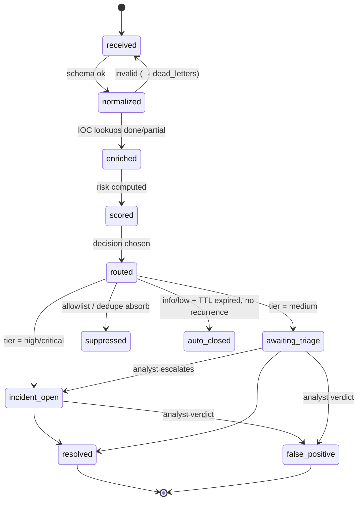

# Architecture

**Project:** AI-Assisted SOC Alert Triage & Incident Response Automation
**Scope of this document:** complete system design for a small-to-medium SOC lab that is
production-*style* (structured, testable, secure by default) while remaining a
portfolio/homelab project. No production deployment is claimed.

---

## Table of Contents

1. [Goals & Non-Goals](#1-goals--non-goals)
2. [System Context](#2-system-context)
3. [Components & Responsibilities](#3-components--responsibilities)
4. [End-to-End Data Flow](#4-end-to-end-data-flow)
5. [Alert Lifecycle & Canonical Schema](#5-alert-lifecycle--canonical-schema)
6. [Ingestion & Normalization](#6-ingestion--normalization)
7. [Enrichment Subsystem](#7-enrichment-subsystem)
8. [Risk Scoring Engine](#8-risk-scoring-engine)
9. [Decision & Routing Engine](#9-decision--routing-engine)
10. [Incidents, Notifications & Feedback](#10-incidents-notifications--feedback)
11. [n8n Workflow Architecture](#11-n8n-workflow-architecture)
12. [Python Service (Triage API) Architecture](#12-python-service-triage-api-architecture)
13. [Docker & Deployment Architecture](#13-docker--deployment-architecture)
14. [Configuration & Secret Management](#14-configuration--secret-management)
15. [Logging, Audit & Observability](#15-logging-audit--observability)
16. [Error Handling & Resilience](#16-error-handling--resilience)
17. [Testing Strategy](#17-testing-strategy)
18. [Security Architecture Summary](#18-security-architecture-summary)
19. [Scaling Path](#19-scaling-path)
20. [Architectural Decision Records (ADRs)](#20-architectural-decision-records-adrs)

---

## 1. Goals & Non-Goals

**Goals**

1. Automate the repetitive L1 triage loop: ingest → normalize → enrich → score → route → notify → capture feedback.
2. Explainability first: every score and decision carries machine-readable + human-readable justifications.
3. Work entirely on free tiers / self-hosted open source (public VirusTotal API, self-hosted MISP, optional TheHive **Community Edition**).
4. Safe by default: no destructive response actions without explicit human approval; no offensive capabilities anywhere in the codebase.
5. Realistic: models real Wazuh 4.x alert shapes, real SOC tiering/SLA concepts, real analyst feedback loop.

**Non-Goals**

- Autonomous containment/punishment of hosts or users without approval.
- Replacing a SIEM — Wazuh stays the detection engine; this platform triages its output.
- High-scale ingestion (>~50 alerts/sec). The design targets a lab/SMB SOC (~10k alerts/day ceiling), with a documented scaling path.
- Any offensive tooling (exploitation, DoS, malware analysis execution, etc.).

---

## 2. System Context



Only `n8n` (5678) and `triage-api` (8000) publish ports on the host by default; Mailpit
publishes its UI (8025) for lab convenience. Wazuh enrollment ports (1514/1515/1516)
publish only under the `full` profile. MISP and PostgreSQL stay internal (profiles
`intel` / `postgres`).

---

## 3. Components & Responsibilities

| Component | Technology | Responsibilities | Phase |
| --- | --- | --- | --- |
| **Triage API** | Python 3.11, FastAPI, SQLAlchemy, Pydantic v2 | Ingest endpoint; normalization; dedupe; IOC extraction; enrichment orchestration; scoring; decision engine; persistence; REST surface for alerts/incidents/feedback/health; audit trail | 1–3 |
| **Scoring engine** | Pure-Python package (`soc_triage.scoring`) | Deterministic 0–100 scoring from a versioned, config-driven factor set; emits justifications; fully unit-testable (no I/O) | 1 (v1), 2 (v2) |
| **Enrichment adapters** | httpx + cache | VirusTotal v3 client (token bucket, TTL cache), MISP client, static allowlist/asset-inventory loader; graceful degradation on outage/quota | 2 |
| **n8n** | n8n (self-hosted) | Notification fan-out, SLA escalation timers, incident ticket creation, analyst feedback form, daily digest; workflow JSONs version-controlled in `n8n/workflows/` | 1–3 |
| **Wazuh manager** | Wazuh 4.x | Detection source: rules/decoders/FIM; ships alerts via its `integrator` module + custom script; optional API queries for agent context | 4 |
| **Simulator** | `scripts/send_test_alert` | Replays synthetic alerts from `docs/sample-alerts/` (also CI fixtures) so the whole pipeline is demoable without Wazuh | 1 |
| **Persistence** | SQLite (file volume) → PostgreSQL | Tables: `alerts`, `ioc_observations`, `incidents`, `feedback`, `audit_log`, `dead_letters`; migrations via Alembic | 1 / 3 |
| **Mailpit** | axllent/mailpit | Local SMTP sink + web UI — proves email flows without touching real relays | 1 |
| **MISP (optional)** | MISP docker (profile `intel`) | Self-hosted threat intel: seeded with public/synthetic events; attribute lookups enrich alerts | 2 |
| **SOC console (later)** | Static HTML + JSON endpoints (optionally Grafana profile) | Alert queue, score justifications, incident board, FP-rate trends | 3 |
| **TheHive CE (optional, later)** | TheHive 5 Community Edition | Case management export — CE only, never Premium | 4+ |
| **LLM assistant (optional)** | any OpenAI-compatible API | Draft analyst-facing summaries/suggestions appended **after** deterministic scoring; always labeled; disabled by default | 5 |

---

## 4. End-to-End Data Flow



**Design rules along the flow**

- Every step appends to an append-only `audit_log` (who/what/when/before→after).
- Any enrichment failure **must not** block scoring: the alert proceeds, flagged
  `enrichment_status: partial|failed` (see §16).
- The scoring engine is a pure function: `(canonical_alert, enrichments, config) → score + justification`.
- Analysts can always trace: alert → IOCs → intel verdicts → factor scores → decision → notification/SLA events.

---

## 5. Alert Lifecycle & Canonical Schema

### 5.1 Status machine



### 5.2 Canonical alert record (Pydantic model, Phase 1)

```jsonc
{
  "alert_id": "3f9d2b1e-…-uuid",             // internal UUID
  "source": "wazuh",                          // wazuh | simulator
  "received_at": "2026-08-29T10:15:30Z",
  "source_event": {                           // trimmed original payload (full_log kept)
    "rule": { "id": "5710", "level": 5, "description": "…",
              "groups": ["syslog","sshd","authentication_failed"],
              "mitre": { "id": ["T1110"], "tactic": ["Credential Access"] } },
    "agent": { "id": "001", "name": "web-prod-01", "ip": "10.0.1.10" },
    "location": "/var/log/auth.log",
    "full_log": "…sanitized raw line…"
  },
  "iocs": [                                   // Phase 1E: extraction + provenance
    { "type": "ipv4", "value": "203.0.113.50",
      "provenance": [
        { "field": "source_event.data.srcip", "extractor": "typed_field",
          "raw_value": "203.0.113.50", "offset": null,
          "location": "/var/log/auth.log" },
        { "field": "source_event.full_log", "extractor": "text_scan",
          "raw_value": "203.0.113.50", "offset": 62,
          "location": "/var/log/auth.log" }
      ],
      "enrichment": { "vt": { "reputation": "malicious", "malicious": 38,
                              "suspicious": 4, "cached": true },
                      "misp": { "matched_event_ids": ["1024"],
                                "tags": ["apt","tlp:amber"] },
                      "allowlist": { "matched": false } } }
  ],
  "dedupe": { "group_key": "5710:001", "occurrences": 9,
              "first_seen": "…", "last_seen": "…" },
  "asset": { "name": "web-prod-01", "tier": "tier-1", "owner": "platform-team" },
  "risk": {
    "score": 78, "tier": "high", "engine_version": "v2",
    "factors": [
      { "name": "rule_severity", "points": 26, "max": 30,
        "detail": "Wazuh level 5 → band 5-6" },
      { "name": "threat_intel", "points": 19, "max": 25,
        "detail": "VT malicious=38/70; MISP event 1024 tags: apt" }
    ]
  },
  "decision": { "action": "open_incident", "severity": "SEV2",
                "reasons": ["tier=high", "intel confirms malicious srcip"],
                "runbook": "runbooks/ssh-brute-force.md", "decided_at": "…" },
  "enrichment_status": "complete",            // complete | partial | failed | skipped
  "status": "incident_open",
  "incident_id": "INC-2026-08-29-0007"
}
```

Notes: raw payloads are size-capped; the platform never adds sensitive fields of its own —
it stores what Wazuh already logged (see SECURITY.md data policy).

---

## 6. Ingestion & Normalization

**Endpoint:** `POST /api/v1/alerts/ingest`

- AuthN: `X-API-Key` (constant-time comparison). Upgrade path: HMAC-SHA256 signature
  (`X-Signature` over body + timestamp) for per-source keys — see SECURITY.md.
- Guards: request body ≤ 256 KiB; per-key rate limit (default 120 req/min, tunable);
  Pydantic validation with a *tolerant* schema (unknown fields preserved under
  `source_event`, never rejected for extras — Wazuh rulesets evolve).

**Normalization:** map Wazuh 4.x JSON → canonical record. Key mappings:
`rule.level`, `rule.id`, `rule.groups[]`, `rule.mitre`, `agent.{id,name,ip}`,
`data.srcip/dstuser/srcuser`, `full_log`. The normalizer is fixture-tested against every
file in `docs/sample-alerts/` (they double as contract tests).

**Deduplication & idempotency (Phase 1C):** deduplication is pure domain logic
(`soc_triage.ingest.deduplication`) — it never imports FastAPI and is fully
deterministic/unit-testable.

- *Event identity* — deterministic: `wazuh:{event_id}:{rule_id}:{agent_id}` when Wazuh
  supplies an event id (the idempotency key is bound to rule/agent context so a re-use of
  an id can never silently collapse divergent content); otherwise a versioned SHA-256
  content hash (`wazuh-h1:{digest}`) over the full validated payload minus volatile
  fields (`rule.firedtimes`, a per-delivery counter).
- *Group key* — `wazuh:{rule_id}:{agent_id}` (percent-encoded components, collision-free).
- *Configurable window* — `TRIAGE_DEDUPE_WINDOW_SECONDS` (default 900 s). An arrival is
  within the window when `received_at − group.last_seen ≤ window`.
- *Three distinguishable outcomes:* **exact duplicate** (same event identity re-delivered
  within the window → idempotent: the original canonical alert and its `alert_id` are
  returned unchanged, `200 duplicate:true`, recurrence state untouched); **repeated**
  (distinct event within the window → `occurrences`/`last_seen` bump — the recurrence
  signal scoring later consumes); **new generation** (group's first event or a distinct
  event after the window → `occurrences` resets to 1, `generation` increments).
- *Evidence is never silently discarded:* duplicate deliveries are counted
  (`duplicate_deliveries`, per-event `delivery_count`), logged, and answered with the
  preserved original alert; a re-delivery with divergent content under a known identity
  increments `content_variants` and logs a warning. Beyond the window an old event is
  treated as fresh evidence (a new occurrence), never swallowed.
- State is persisted (Phase 1D, SQLite via `PersistentDeduplicator` + the
  `alert_dedupe_groups` / `alert_events` tables) behind a `Deduplicator`
  protocol and is restored on restart; the in-memory `InMemoryDeduplicator`
  remains available for tests. Both backends share the pure `decide_delivery`
  state machine, so the persistence-backed implementation reproduces this
  contract exactly (thread-safe, exactly-once per identity within the window,
  monotonic occurrence counters).

**Dead letters:** payloads that fail validation 3× land in `dead_letters` with the parse
error — nothing is silently dropped.

---

## 7. Enrichment Subsystem

### 7.1 IOC extraction (Phase 1E — implemented)

A **pure function** (`soc_triage.enrichment.extractor`): `(CanonicalAlert, policy) → [IOC]`
— no I/O, clock, logging or randomness, so repeated extraction is byte-identical.
Indicators are deduplicated by `(type, normalized value)` and ordered by the same key.

**Sources.** Regex/grammar extraction from canonical fields, **not** from arbitrary
`full_log` text (that remains opt-in per deployment):

* *Typed fields* — `agent.ip`, `data.srcip`, `data.dstip`, `data.hostname`, `data.url`,
  `data.srcuser` / `data.dstuser`, `data.virustotal.{md5,sha1,sha256,permalink}` and the
  FIM `syscheck.{md5,sha1,sha256}_{before,after}` hashes. The **whole** field value must
  validate as that one type; a field that fails yields nothing rather than a partial guess.
* *Text scans* (policy-gated) — `full_log` and `location` are off by default; unrecognized
  string leaves under `data` / `syscheck` are auto-scanned by default.

**Types (Phase 1E):** `ipv4`, `domain`, `url`, `md5`, `sha1`, `sha256`, `email`.
(`ipv6` and `filepath` are deferred: neither the corpus nor the scoring engine needs them
yet, and adding them is a pattern + validator change in one module.)

**Provenance** is preserved per indicator: the canonical field path, the alert's source
`location`, the character offset and raw substring for text scans, and which strategy found
it (`typed_field` / `text_scan`). The same value seen in two fields yields one indicator
with two provenance records.

**False-positive controls** (`soc_triage.enrichment.policy`, frozen and injectable):

| Control | Default | Rationale |
| --- | --- | --- |
| Drop non-routable IPv4 (RFC 1918, loopback, link-local, CGNAT, multicast, reserved, unspecified) | on | internal addresses are not external indicators |
| Drop documentation ranges (RFC 5737 / RFC 2544) | **off** | the synthetic corpus *is* built from those ranges (SECURITY.md §5); deployments ingesting real alerts can flip it |
| Scan `full_log` / `location` | off | they are descriptors, and path-like values (`/etc/passwd`) would otherwise look like domains |
| `max_iocs` per alert | 200 | bounded responses and bounded future quota usage |

Plus format-level guards: IPv4 via `ipaddress` (rejects `999.1.1.1`, `010.1.1.1`,
`1.2.3.4.5`), domains by LDH labels + alphabetic TLD (rejects Windows paths and
`*.exe` filenames), hashes by hex length (32/40/64), emails by local-part + domain
rules, URLs canonicalized (host lowercased/IDNA, default port and fragment dropped,
**userinfo removed** so credentials can never be stored as an indicator). Defang
markers (`hxxp://`, `evil[.]example[.]com`) are normalized; the raw match is kept in
provenance.

### 7.2 Enrichment chain (ordered, per IOC)

| Order | Source | Behavior | On failure |
| --- | --- | --- | --- |
| 1 | **Allowlist** (`app/config/allowlists.yaml`) | known-good scanner IPs, backup jobs, CDN ranges → mark `allowlisted`, apply suppression modifier | fail-open (log warn) |
| 2 | **Local cache** (TTL 6 h hashes / 1 h IPs) | SQLite-backed; avoids quota burn | fail-open |
| 3 | **VirusTotal v3** (public tier) | token bucket **4 req/min, 500/day**; only hash/IP/domain endpoints; never abort on quota — queue & continue | mark `vt: quota_exceeded`, continue |
| 4 | **MISP** (`/attributes/restSearch`, profile `intel`) | attribute + event context, tags (e.g., `apt`, `tlp:amber`, false-positive tags) | mark `misp: unavailable`, continue |

### 7.3 Guarantees

- Enrichment **never blocks** the pipeline beyond a 5 s budget: slow uncached lookups are
  skipped, the alert proceeds, and a background retry fills gaps later (best-effort
  re-score on arrival).
- Every outbound call is logged (target host only — never API keys), timed, and counted
  (quota usage per day) so quota state is observable.
- Optional sources auto-disable when their env keys are empty — the system must run fully
  functional (scoring v1) with **zero external services**.

**Phase 1E status of this subsystem:** extraction (§7.1) and the provider interface are
implemented; steps 1–4 below are **not**. Providers implement the runtime-checkable
`soc_triage.enrichment.providers.EnrichmentProvider` protocol (`name`, `enabled`,
`enrich(iocs, *, context) → ProviderEnrichment`); `EnrichmentChain` runs them in
registration order, merges payloads per indicator, and aggregates
`enrichment_status: complete|partial|failed|skipped`. A provider that raises is recorded
as `failed` (exception *type* only, never its message) and skipped — enrichment never
blocks ingestion. The only registered provider today is the offline, disabled-by-default
`NoOpEnrichmentProvider`, so VirusTotal/MISP lookups arrive in Phase 2 without changing
the orchestration.

---

## 8. Risk Scoring Engine

Deterministic, config-driven, versioned (`scoring.v1`, `scoring.v2`). Weights live in
`app/config/scoring.yaml` (schema-validated, git-versioned) — tuning requires no code
change, and every change is a reviewable diff.

### 8.1 Factor set v1 (MVP — no external intel)

| Factor | Max | Computation sketch |
| --- | --- | --- |
| `rule_severity` | 40 | band map of Wazuh `rule.level`: 0–2→0 · 3–4→6 · 5–6→14 · 7–8→22 · 9–10→30 · 11–15→40 |
| `rule_groups_mitre` | 15 | `authentication_failed`/`malware`/`attack` groups +4 each; any MITRE technique +4; ≥2 tactics +3 (cap 15) |
| `asset_criticality` | 25 | inventory tier: critical=25 · high=18 · medium=10 · low=5 · unknown=8 |
| `recurrence_velocity` | 20 | ≥3 in 15 min → +12; ≥10 in 24 h → +8; rising burst +6 (cap 20) |
| `allowlist_modifier` | −20 | allowlisted source subtracts points (floor 0) |

### 8.2 Factor set v2 (adds threat intel, Phase 2)

| Factor | Max | Computation sketch |
| --- | --- | --- |
| `rule_severity` | 30 | same bands, rescaled |
| `rule_groups_mitre` | 10 | as above |
| `asset_criticality` | 20 | as above |
| `recurrence_velocity` | 15 | as above |
| `threat_intel` | 25 | VT: malicious≥10→15 · 2–9→8 · suspicious-only→4. MISP: event match→10, `apt`/threat-actor tag→+5 (factor cap 25) |
| `allowlist_modifier` | −25 | as above |

### 8.3 Tiers & output

- Total clipped to 0–100: `0–24 informational` · `25–44 low` · `45–69 medium` · `70–84 high` · `85–100 critical`.
- Output always includes `engine_version`, per-factor `points/max/detail`, and a generated
  one-paragraph human summary (template-based in v1/v2; optional LLM polish in Phase 5,
  clearly labeled `ai_assisted: true` and never used for the numeric score).
- Golden-file tests pin expected scores for the sample-alert scenarios; any weight change
  must consciously update the goldens (that is the tuning workflow).

### 8.4 ATT&CK technique identity is not a scoring input

`rule_groups_mitre` counts ATT&CK **presence** only; which technique an alert maps to
never influences a score, tier, or action. The maintained, provenance-carrying mapping
of the repository's rules and scenarios to ATT&CK techniques lives in
`evaluation/attack_mappings.yaml` (Phase 6.2; rendered in `docs/attack-coverage.md`,
validated by static tests, with declared values recorded verbatim and matrix
verification explicitly `unverified`). It is a reporting/traceability artifact: the
runtime consumes only the source-declared `rule.mitre` block verbatim and never
consults the registry.

---

## 9. Decision & Routing Engine

Policy table (Phase 1 target; thresholds configurable in `app/config/decisions.yaml`):

| Tier | Action | Notification | Ack SLA | Notes |
| --- | --- | --- | --- | --- |
| **critical (85–100)** | Open incident **SEV1** + propose containment runbook | page (urgent email + chat) | 15 min | containment actions require analyst approval |
| **high (70–84)** | Open incident **SEV2** | email + chat | 30 min | |
| **medium (45–69)** | Queue `awaiting_triage` | batched digest (2 h) | 4 h | re-score on recurrence escalation |
| **low (25–44)** | Dashboard only | daily digest | — | |
| **informational (0–24)** | Auto-close after 7-day TTL if no recurrence | none | — | closed rows retained for FP analytics |

Additional routing rules:

- **Allowlisted → suppressed** regardless of score (audit entry retained).
- **MITRE-tagged** alerts link a runbook from `docs/runbooks/<scenario>.md` (Phase 3).
- Decisions are re-evaluated when recurrence thresholds cross or late enrichment lands.

---

## 10. Incidents, Notifications & Feedback

**Incidents** (Phase 3): `incidents` table with id `INC-YYYY-MM-DD-NNNN`, severity,
linked alert/dedupe groups, timeline (audit-derived), and resolution notes. Optional
TheHive CE export creates a mirrored case (never required). Phase 3.2 adds the
incident lifecycle: a strict status model (`open → investigating/acknowledged/
false_positive/escalated → …`, terminal `resolved`/`false_positive`) enforced by
`PATCH /api/v1/incidents/{id}/status` (structured 404/409) and by analyst feedback
on linked alerts — a verdict is never proof of remediation, so feedback never
auto-resolves and `contain_requested` only records an approval-required audit
entry. Lifecycle timestamps (`acknowledged_at`, `resolved_at`) are populated only
when the corresponding state is reached; every change is append-only audited
(`incident.status_updated`, `incident.escalated`, `incident.containment_requested`).

**Read APIs + timeline** (Phase 3.3): analyst-safe GET surfaces for the SOC
console, authenticated with the existing shared N8N token (same channel as
feedback / incident status; a dedicated analyst/read token is deferred to the
console milestone — SECURITY.md §3). All five endpoints are **read-only**: they
never write audit rows, never transition incidents, and never call n8n / Wazuh /
VirusTotal / MISP / TheHive / an LLM.

| Method | Path | Query | Notes |
| --- | --- | --- | --- |
| GET | `/api/v1/alerts` | `limit` (1–200, default 50), `offset` (≥0), `source`, `incident_id`, `rule_id`, `agent_id`, `tier` (risk tier), `severity` (decision SEV1/SEV2), `dedupe_group_key`, `duplicate` (bool: absorbed ≥1 exact re-delivery) | Newest-first (`received_at DESC, alert_id DESC`). No `full_log`, tokens, or credentials. |
| GET | `/api/v1/alerts/{alert_id}` | — | Identity, rule/agent, risk/decision, dedupe, incident link, IOC summaries, trimmed `source_event` (no `full_log`). Structured `404`. |
| GET | `/api/v1/incidents` | `limit`/`offset` as above, `status`, `severity`, `dedupe_group_key`, `created_from`, `created_to` (inclusive UTC) | Newest-first (`created_at DESC, incident_id DESC`). |
| GET | `/api/v1/incidents/{incident_id}` | — | Metadata, lifecycle timestamps, primary + linked alert summaries/count. Structured `404`. |
| GET | `/api/v1/incidents/{incident_id}/timeline` | — | Chronological events from existing `audit_log` rows for the incident id and every linked alert id (`incident.created`, `incident.status_updated`, `incident.escalated`, `alert.created`/`scored`/`decided`, `feedback.received`, …). Sorted by `occurred_at` then audit `id` (deterministic on equal timestamps). Structured `404`. |

List responses use `{items, pagination: {limit, offset, total, has_more}}`. Unknown
resources use the shared error envelope `{"error": {"code": "not_found", "message": "…"}}`.

#### §10.4 — Auto-close TTL sweeper (Phase 3.4)

A lightweight, restart-safe background loop (asyncio task started from the
FastAPI lifespan — no Celery/Redis/APScheduler, per ADR-4) periodically scans
for incidents that have been idle past a configurable TTL and transitions them
to `resolved` following a strict, auditable rule set.

**TTL semantics**

* Setting: `INCIDENT_AUTO_CLOSE_TTL_SECONDS` (default **604800 s = 7 days**,
  conservative lab value; environment-driven; validated to be ≥ 1).
* Activity timestamp: **`incidents.updated_at`** — the same timestamp bumped by
  every lifecycle transition (PATCH `/incidents/{id}/status`) and by feedback
  synchronisation (Phase 3.2). It is the natural "last touched" column; no new
  timestamp is introduced.
* Eligibility rule: an incident is eligible iff **all** of:
    1. `status ∈ {open, investigating, acknowledged, escalated}` (non-terminal);
    2. `updated_at ≤ now − TTL` (no analyst/feedback activity inside the TTL
       window).
* Explicitly **excluded** from auto-close:
    * `resolved` / `false_positive` (terminal states, no outgoing transitions);
    * any incident whose `updated_at` was bumped by a manual PATCH, feedback
      verdict, or escalation within the TTL window;
    * any incident that does not meet the predicate at the moment the
      conditional UPDATE is applied (see race safety below).

**Automatic transition**

Eligible incidents are moved to `resolved` via the existing lifecycle semantics:

* `status := resolved`;
* `updated_at := sweep_time` (UTC);
* `resolved_at := sweep_time` — set **exactly once** (the conditional UPDATE
  only targets non-terminal rows whose `resolved_at IS NULL`, so a re-run never
  overwrites a prior resolution timestamp);
* `acknowledged_at` is preserved untouched (analyst acknowledgement history is
  never erased by the sweeper);
* no new lifecycle state is introduced; `open → resolved` is permitted as a
  narrow, audited exception for the `system:sweeper` actor only (manual
  transitions still enforce the strict state machine, so an analyst cannot
  "skip" investigation via the public API).

**Audit**

Every successful auto-close appends exactly one `audit_log` row:

* `actor = "system:sweeper"`;
* `action = "incident.auto_closed"`;
* `before = {"status": <previous non-terminal status>}`;
* `after` carries a small structured snapshot: `incident_id`, `status`
  (`"resolved"`), `previous_status`, `acknowledged_at`, `resolved_at`,
  `ttl_seconds`, `idle_seconds` (age of the incident at close time, seconds),
  `reason = "ttl_expired"`, `actor`.

No secrets, no raw alert payloads, no free-form notes. Idempotency is enforced
by the conditional UPDATE: an already-resolved incident never matches the
predicate, so re-runs never append a second `incident.auto_closed` row.

**Concurrency / race safety**

Each candidate is closed inside its own transaction via a single conditional
`UPDATE incidents SET status='resolved', updated_at=:ts, resolved_at=:ts WHERE
incident_id=:id AND status=:expected_status AND updated_at=:expected_updated_at
AND updated_at <= :cutoff`. If an analyst PATCH (or feedback sync) bumps
`updated_at` or changes the status between the sweeper's SELECT and this
UPDATE, the UPDATE matches zero rows, the transaction commits no changes, no
audit row is appended, and the manual action wins.

The sweeper is **single-instance** by design (ADR-4). On SQLite the
single-writer lock serialises the UPDATE; on PostgreSQL the same statement is
atomic without distributed locks. The sweeper explicitly does **not** claim
cross-process / distributed-lock semantics — multi-instance deployments are
Phase 3.8+ (Postgres profile + dedicated worker).

**Runtime behavior**

* Interval is configurable via `INCIDENT_SWEEPER_INTERVAL_SECONDS` (default
  300 s / 5 minutes); validated to be ≥ 1.
* The first pass runs immediately at startup so stale incidents left behind by
  a prior crashed process are closed without waiting a full interval.
* Each candidate is processed in its own short transaction; a failure on one
  incident is logged (`error_type` only, never exception messages) and the
  loop continues — a single bad row can never kill the periodic task.
* On shutdown the lifespan cancels the background task and awaits it cleanly
  before disposing the engine, so no task is leaked and no in-flight close is
  left mid-commit.
* No new public API endpoint is exposed; GET endpoints never trigger the
  sweeper. The sweeper is background behavior only.
* Structured logs (`sweeper_started`, `sweeper_pass_completed` with
  `candidates/closed/skipped/errors/duration_ms`, `incident_auto_closed`,
  `sweeper_incident_failed`, `sweeper_stopped`) make the sweeper observable
  without introducing Prometheus metrics (deferred to Phase 3.7).

**Restart behavior**

The sweeper's only state is the rows in `incidents` + `audit_log` (both
durable). On startup the task runs one immediate pass against whatever it
finds, so auto-closes survive restarts and backlogged stale incidents are
picked up without operator action. A restart mid-sweep simply leaves
unclosed candidates for the next pass (idempotent).

**Notifications** (n8n-mediated): the API never talks to SMTP/chat directly; it POSTs a
compact `scored_alert` event to the n8n webhook (with `N8N_CALLBACK_TOKEN`). The message
contains: agent, rule, top IOCs + intel verdicts, score + top factors, runbook link, a
deep link to the alert in the console, and acknowledgement actions. Lab email → Mailpit sink.

**Feedback loop:** analyst submits `true_positive | false_positive | escalate | contain`
via n8n form or direct API; stored in `feedback` + audit; `false_positive` on a rule+agent
pair 3× raises a "tuning suggestion" in the digest (humans approve rule changes — the
platform never auto-edits Wazuh rules).

---

## 11. n8n Workflow Architecture

Workflows are exported JSON under `n8n/workflows/` (version-controlled; import per
`n8n/README.md`). One concern per workflow:

| ID | Workflow | Trigger | Flow |
| --- | --- | --- | --- |
| WF1 | `soc-triage-router` | webhook `/webhook/soc-alert-scored` (API callback) | auth check → Switch on tier → route to WF2/WF3 |
| WF2 | `soc-analyst-notify` | called by WF1 | render message (IOCs, score factors, runbook) → Email (SMTP) + chat webhook → hand off to WF4 |
| WF3 | `soc-incident-create` | called by WF1 (high/critical) | create incident via API (or TheHive CE case if enabled) → attach to notification |
| WF4 | `soc-sla-escalation` | from WF2 | Wait node (15/30 min) → if no ack (checked via API) → escalate: re-notify with L2 tag, loop max 2× |
| WF5 | `soc-analyst-feedback` | n8n Form trigger (`/form/soc-analyst-feedback-form`) + machine webhook `/webhook/soc-analyst-feedback` | form pages (alert_id, analyst_email, verdict allow-list, notes) → validate → POST `/api/v1/alerts/{id}/feedback` (token auth) → confirmation |
| WF6 | `soc-daily-digest` | Cron 07:00 UTC | query API stats endpoints → email digest (volumes, top rules, FP rate, tuning suggestions) |

**n8n error strategy:** a global error workflow posts to the API `/internal/n8n-errors`
for audit + console visibility; every node sets explicit continue/fail behavior; secrets
live in n8n credentials (encrypted via `N8N_ENCRYPTION_KEY`), never in exported JSON —
the repo's workflow files contain only credential *references*.

---

## 12. Python Service (Triage API) Architecture

```
app/src/soc_triage/
├── main.py                 # app factory, lifespan (db init + migrations, config load), health
├── api/                    # routers: alerts (ingest/get/list), incidents, feedback,
│                           #        stats, health, metrics, internal (n8n errors)
├── core/                   # config (pydantic-settings, env-driven), logging (structlog),
│                           # metrics (Prometheus registry, app-scoped), security
│                           # (api-key auth, rate limiting), errors, ids
├── db/                     # engine/session bootstrap, unit-of-work transactions,
│                           # storage errors (never leaks internals)
├── models/                 # SQLAlchemy ORM (alerts, alert_dedupe_groups, alert_events,
│                           #                audit_log) + repositories + Pydantic canonical
├── ingest/                 # wazuh normalizer, dedupe (in-memory + persistent), guards
├── enrichment/             # ioc_extractor, vt_client, misp_client, allowlist, cache
├── scoring/                # engine.py (pure), factors.py, config loader, summaries
├── decisions/              # policy table, router, runbook registry
├── notifications/          # n8n webhook client (outbound only)
├── audit.py                # append-only audit_log policy + entries
└── (app/alembic)           # Alembic migrations (SQLite now, identical on PostgreSQL)
```

**Layering rules (enforced in review):**

- `api/` only translates HTTP ↔ services; business logic lives in domain packages.
- Domain packages (`ingest`, `enrichment`, `scoring`, `decisions`) **never** import FastAPI.
- All I/O-bound external calls go through injected clients (`httpx.AsyncClient`) — tests inject fakes.
- DB access only in `models/` repositories; the scoring engine has **zero** I/O.
- Background work: Phase 1 uses FastAPI background tasks + a periodic re-score loop;
  Phase 3 may extract an asyncio worker process if load demands (no Celery/Redis until
  measurably needed — see ADR-4).
- Observability is additive and non-load-bearing: metrics are recorded at the API
  orchestration layer (plus optional injected recorders in the enrichment chain and
  sweeper); the scoring engine stays I/O-free and instrumentation never affects
  outcomes, responses, or audit rows (Phase 3.7, ADR-9).

---

## 13. Docker & Deployment Architecture

**Stacks via compose profiles** (lands in Phase 1, design fixed now):

| Service | Image (pinned by tag) | Profile | Networks | Published ports | Purpose |
| --- | --- | --- | --- | --- | --- |
| `triage-api` | built from root `Dockerfile` (kept-in-sync copy: `deploy/triage-api.Dockerfile`) | default | soc-core, soc-edge | 8000 | Triage API |
| `n8n` | `n8nio/n8n:<pinned>` | default | soc-edge, soc-core | 5678 | orchestration |
| `mailpit` | `axllent/mailpit:<pinned>` | default | soc-core | 8025, 1025 | SMTP sink |
| `wazuh-manager` | `wazuh/wazuh-manager:4.x` | `full` | soc-core | 1514–1516 (agents) | real detection source |
| `misp-*` | MISP docker stack | `intel` | soc-core | internal only | threat intel |
| `postgres` | `postgres:16-alpine` | `postgres` | soc-core | internal only | scalable DB |
| `prometheus` | `prom/prometheus:v3.5.0` | `observability` | soc-core | internal only | optional scrape of `triage-api:8000/metrics` |
| `grafana` | `grafana/grafana:12.1.0` | `observability` | soc-core | 3000 | optional dashboards (lab) |

**Conventions:** named volumes for `/data` (API), n8n home, Wazuh var, MISP/PG data;
healthchecks on every service (`/health`/`/ready` for the API, SMTP ping for Mailpit);
`restart: unless-stopped`;
CPU/memory limits per service; containers run non-root (the API image creates an `app`
user); images pinned by tag (digest pinning when a release is cut); `deploy/` holds
Dockerfiles + compose fragments so the root `docker-compose.yml` stays small.

**Observability profile (Phase 3.7, implemented in D11):**
`docker compose --profile observability up` adds two *optional* services and changes
nothing in the default stack:

- `prometheus` (`prom/prometheus:v3.5.0`, `soc-core` only) scrapes `triage-api`
  internally at `http://triage-api:8000/metrics` with a **15 s scrape interval and 10 s
  timeout**; **port 9090 is never published to the host** (no `ports` entry at all).
  Its config lives in `deploy/prometheus/prometheus.yml` (one static job, no external
  targets, no secrets). Optional `METRICS_SCRAPE_TOKEN` bearer credentials are supplied
  via the existing environment mechanism: `deploy/prometheus/entrypoint.sh` writes the
  runtime token to a tmpfs credentials file (0600) and generates the scrape config with
  `authorization.credentials_file` — never hardcoded, never inlined, and never sent when
  the token is empty (which matches the API's "empty = auth disabled").
- `grafana` (`grafana/grafana:12.1.0`, `soc-core`; **port 3000 published for the lab
  only**) is provisioned from `deploy/grafana/provisioning/` (Prometheus datasource
  pointing at `http://prometheus:9090`) and dashboards in `deploy/grafana/dashboards/`
  (one 13-panel `soc-triage-observability` dashboard using only the approved metric
  catalog). Everything in those files is non-secret; dashboards are labeled
  lab/portfolio use.
- Both services: non-root image users, `cap_drop: ALL`, `no-new-privileges`, read-only
  root filesystem + tmpfs, healthchecks (`/-/healthy` for Prometheus, `/api/health` for
  Grafana), 1 CPU / 512 MB resource limits, named state volumes (`prometheus-data`,
  `grafana-data`), `soc-core` only.
- The API's `/metrics` endpoint is the only requirement for the profile; neither service
  is required to run the pipeline. Existing services never gain a `depends_on` on
  `prometheus`/`grafana`.

**Two run modes:**

- **`sim` (default):** no Wazuh needed — the simulator replays `docs/sample-alerts/` for demos/CI.
- **`full`:** adds the Wazuh manager profile; agents enroll over 1514/1515; the
  `integrator` custom script forwards matched rules to the ingest endpoint.

**`full` profile (Phase 4.1, implemented):**
`docker compose --profile full up` adds exactly one *optional* service and changes
nothing in the default stack:

- `wazuh-manager` (`wazuh/wazuh-manager:4.9.2`, pinned; `soc-core` only) publishes
  **1514/1515 for agent enrollment/reporting only** — the Wazuh API (55000) is never
  host-visible. No default service gains a `depends_on`, so `sim` mode and the
  zero-external fallback are untouched.
- Credentials (`API_USERNAME`, `API_PASSWORD`, `TRIAGE_INGEST_API_KEY`) use
  `${VAR:?}` — required, no committed defaults, fail-fast on `up`.
- Repo-sourced mounts (`wazuh/config/ossec.conf`, `wazuh/integrator/`,
  `wazuh/entrypoint-scripts/`) are read-only; only `wazuh-manager-{etc,logs,queue}`
  named volumes are writable. `no-new-privileges`, healthcheck via
  `wazuh-control status`, 2 CPU / 2 GB limits.
- **Image-contract details (verified against the pinned 4.9.2 image source).**
  Wazuh has **no `ossec.conf.d` include mechanism**: the image copies
  `/wazuh-config-mount/<path>` over `/var/ossec/<path>` (`cont-init.d/0-wazuh-init`),
  so the profile mounts a *complete* `ossec.conf` derived from the official v4.9.2
  single-node template, with `<indexer>`/`<vulnerability-detection>` disabled (this
  stack runs no indexer) and upstream's hardcoded cluster key replaced by the
  entrypoint's substitution marker. `wazuh-integratord` resolves the script as
  `integrations/<name>` relative to `/var/ossec` and requires `root:wazuh` mode
  `750`, so `wazuh/entrypoint-scripts/10-install-triage-integration.sh` installs it
  (via the image's `/entrypoint-scripts/*.sh` hook) rather than bind-mounting it
  with host ownership. `wazuh-integratord` is an *optional* daemon: it starts only
  when an `<integration>` block is present.
- **No active-response / containment configuration is mounted or defined** — the profile
  is a detection source only (SECURITY.md §1).

**Wazuh integrator (Phase 4.2, ADR-6, implemented):**
`wazuh/integrator/custom-triage` (shell wrapper) → `custom-triage.py` (standard library
only; the manager image has no project dependencies).

- **Environment-only configuration.** The positional `api_key`/`hook_url` arguments that
  `integratord` passes are deliberately ignored as a secret source: `ossec.conf` is
  world-readable inside the container. Everything comes from env (§14).
- **Unchanged auth contract.** It POSTs the *unmodified* Wazuh alert JSON to
  `POST /api/v1/alerts/ingest` with `X-API-Key`. It is an ordinary client of the existing
  endpoint — no new auth path, no bypass, no change to CORS/rate limits/validation.
- **Filtering.** `WAZUH_INTEGRATOR_MIN_LEVEL` (default 5) plus optional rule-id/group
  exclusion lists, applied before any network call.
- **Retry + local buffering (durability without a broker).** Transient failures
  (network errors, `408/429/5xx`) retry in-process with capped exponential backoff and
  jitter, then spool to a bounded on-disk FIFO (0700 dir, 0600 write-then-rename entries)
  that the next invocation drains oldest-first. The spool is bounded by count *and* age;
  overflow drops the oldest entries. Permanent rejections (`4xx` other than 408/429) are
  dropped, never replayed. This is the manager-side counterpart to the API's
  "ingest returns retryable 503 (Wazuh integrator buffers)" contract in §16.
- **Never blocks the manager.** Every path exits `0` except an operator-fixable
  configuration error; no exception escapes the transport.
- **Observability.** Structured JSON appended to `/var/ossec/logs/integrations.log`
  (and mirrored to stderr for manager debug mode) with allow-listed
  fields only — rule id/level, agent id, status, attempts, sanitized endpoint. Never the
  API key, alert body, or `full_log`. Note `integratord` appends `> /dev/null 2>&1`
  unless the manager runs at debug level, so the log file — not stderr — is the
  real observability channel. The integrator exposes **no Prometheus metrics**,
  so the approved `soc_triage_*` catalog and its cardinality guarantees are unchanged.
- **Defensive-only.** No subprocess execution, no command evaluation, no
  active-response capability anywhere in the path.

---

## 14. Configuration & Secret Management

- **12-factor rule:** all runtime configuration comes from environment variables, loaded by
  `pydantic-settings` into a typed, validated `Settings` object; the app **fails fast** at
  startup if required secrets are missing or still set to `change-me*` placeholders.
- **Secrets** (API keys, tokens, passwords, `N8N_ENCRYPTION_KEY`) live only in `.env`
  (git-ignored) or an orchestrator secret store; `.env.example` documents every key with
  placeholder values and generation hints. `scripts/check_secrets.sh` scans tracked files.
- **Policies** (scoring weights, decision thresholds, allowlists, asset inventory) are
  **non-secret YAML** under `app/config/` — version-controlled, schema-validated,
  hot-reloadable (explicit refresh endpoint, audit-logged).
- **Disable-by-empty:** optional integrations (VT, MISP, TheHive, LLM, chat) activate only
  when their env keys are non-empty; the core pipeline runs with zero externals.
- **Test/prod parity:** the same image runs everywhere; only env differs. `SOC_ENV` gates
  dangerous conveniences (e.g., debug endpoints exist only when `SOC_ENV=development`).

---

## 15. Logging, Audit & Observability

- **Structured JSON logs** (`structlog`) to stdout — Docker-friendly; one line per event;
  fields: `ts, level, event, alert_id, dedupe_group, component, duration_ms, outcome`.
- **Correlation:** `alert_id` (and `incident_id`) propagate through API → enrichment →
  decision → n8n callback payload, so one alert is traceable end-to-end across services.
- **Secret hygiene in logs:** loggers use allow-listed fields; a unit test asserts no env
  secret value ever appears in log output (canary-value fuzz test).
- **Audit trail:** append-only `audit_log` table (actor, action, entity, before/after JSON,
  timestamp) for every state transition, decision, config change, and analyst verdict.
  This is the system of record for "why did the SOC bot do X".
- **Metrics (Phase 3.7):** Prometheus `/metrics` on the API service (same origin as
  `/health`), Prometheus text exposition, hidden from OpenAPI, optional
  `METRICS_SCRAPE_TOKEN` bearer authentication (dedicated token — the N8N/API tokens are
  never reused; empty = unauthenticated development default). Metrics are **additive and
  non-load-bearing**: one app-scoped `CollectorRegistry` per service instance, counters
  and histograms at existing decision points; recording never raises into the pipeline,
  never writes to the database, never calls external services, and never changes a
  score, decision, dedupe outcome, response body, or audit row (ADR-9).
- **Metric namespace & cardinality:** every application metric is prefixed
  `soc_triage_`. All labels come from fixed enums/registries — never alert contents,
  alert/incident ids, rule/agent ids, IOC values, hosts/URLs, or free text. Route labels
  use route templates (`/api/v1/alerts/{alert_id}`, else `unmatched`). A cardinality-guard
  test asserts every observed `(metric, label-value)` pair is inside the documented
  per-metric allowlist.
- **Metric catalog (Phase 3.7):** request counter + latency histogram
  (`soc_triage_http_requests`, `soc_triage_http_request_duration_seconds`); ingest
  rejections + process counters + pipeline duration (`soc_triage_ingest_rejections`,
  `soc_triage_alerts_processed{outcome}`, `soc_triage_alert_processing_duration_seconds`);
  scoring/decision distribution (`soc_triage_alerts_scored{tier, decision, degraded}`);
  enrichment status + per-provider outcomes (`soc_triage_enrichment_status`,
  `soc_triage_enrichment_provider_outcomes` — never indicator values); n8n notifications
  + duration; feedback verdicts; incident transitions; sweeper
  (`soc_triage_incident_auto_close`, `soc_triage_sweeper_passes`); application health
  (`soc_triage_up`, `soc_triage_database_up`, `soc_triage_migrations_applied`). The
  default `process_*` / `python_info` collectors are **not registered** — the app-scoped
  registry emits exactly the approved families above. Dedupe ratio and error rates are
  derived in Grafana, not emitted. Full table + semantics in
  [`docs/specs/phase-3.7-prometheus-observability.md`](docs/specs/phase-3.7-prometheus-observability.md).
- **No DB aggregates in Phase 3.7:** the only database touch per scrape is the cheap,
  dialect-agnostic liveness ping (`SELECT 1`) and `alembic_version` read already used by
  `/health` / `/ready`. Incident-count-by-status style aggregate gauges are **deferred to
  Phase 3.8** (PostgreSQL profile + migration parity tests) — Phase 3.7 counters are
  in-process, so SQLite/PostgreSQL parity is trivially preserved.
- **Grafana (optional):** visualizes the metrics via the profile-gated `observability`
  compose profile (Prometheus internal scrape + Grafana on port 3000 for the lab,
  ARCHITECTURE §13). No Grafana/Prometheus dependency is mandatory; the pipeline runs
  unchanged without them.
- **Health:** `/health` (liveness: process + DB ping) and `/ready` (readiness: config valid,
  migrations applied, n8n reachable best-effort).

---

## 16. Error Handling & Resilience

| Failure | Detection | Behavior |
| --- | --- | --- |
| Invalid payload | Pydantic validation | 422 + dead-letter record; retried ≤3× then kept for inspection |
| Ingest auth failure | API key mismatch | 401 + security log (rate-limited responses to avoid log flooding) |
| VirusTotal 429/quota | status + retry-after | token bucket blocks send; IOC marked `quota_exceeded`; background retry next window |
| VirusTotal/MISP outage | timeout (3 s), retries (2× exponential + jitter) | mark `unavailable`, continue pipeline, `enrichment_status: partial` |
| DB unavailable | connection error | 503 + liveness fail; ingest returns retryable 503 (Wazuh integrator buffers) |
| n8n webhook unreachable | timeout 2 s | event parked in `pending_notifications`, retried by periodic loop (≤24 h); alert status unaffected |
| Scoring engine exception | try/except boundary | fallback score from `rule_severity` only + `engine_degraded` audit flag (never crash ingest) |
| Duplicate delivery | idempotency key (`source_event.id` when present) | return existing alert (200, `duplicate: true`) |

Principles: **fail open for enrichment, fail closed for secrets, fail loud for the
pipeline**. Nothing is dropped silently; every degraded path writes an audit entry.

---

## 17. Testing Strategy

(Detail, gates, and coverage targets live in [DEVELOPMENT_PLAN.md](DEVELOPMENT_PLAN.md#testing-strategy).)

| Layer | Tooling | Scope |
| --- | --- | --- |
| Unit | pytest; pure functions | scoring engine (golden files per sample scenario), normalizer, dedupe keys, IOC extractor, decision matrix, config validation |
| Contract | pytest + `docs/sample-alerts/*.json` | every sample parses, normalizes, scores — sample updates are breaking-change detectors |
| Integration | FastAPI TestClient + temp SQLite | auth, ingest→state-machine transitions, feedback, audit rows, error paths |
| External fakes | `respx` / fake httpx clients | VT rate limiter & quota behavior, MISP outage, timeout paths |
| E2E smoke (Phase 1+) | compose `sim` profile | simulator → API → SQLite state + n8n webhook receiver; nightly job in CI |
| Security tests | canary-secret log fuzz, authz matrix | no secrets in logs; unauthenticated calls rejected; rate limits enforced |

---

## 18. Security Architecture Summary

Full policy: [SECURITY.md](SECURITY.md). Key points:

- Defensive-only scope enforced by policy and review; no offensive tooling will be merged.
- AuthN: `X-API-Key` ingest (constant-time compare), `N8N_CALLBACK_TOKEN` for workflow
  callbacks; documented upgrade to HMAC request signing; all endpoints rate-limited;
  admin/read endpoints get a separate analyst token in Phase 3.
- Network segmentation (`soc-edge` vs `soc-core`), minimal published ports, non-root
  containers, pinned images, healthchecks, resource limits.
- Data minimization: synthetic test data only; doc-range IPs (RFC 5737/3849); retention
  windows documented in SECURITY.md.
- Platform threat model (STRIDE-lite) maintained in SECURITY.md with per-phase mitigations.

---

## 19. Scaling Path

Designed-in upgrades, deliberately deferred until needed:

1. **SQLite → PostgreSQL** (profile exists from Phase 3; Alembic migrations identical).
2. **Background tasks → dedicated worker** (asyncio worker process; same codebase, `--worker` entrypoint).
3. **Single n8n → queue mode** (Redis + multiple executors) if workflow volume grows.
4. **Per-source HMAC keys + mTLS** on ingest when multiple Wazuh managers report in.
5. **Read replicas / metrics retention** for the console; Grafana long-term storage optional.

The MVP targets ~10k alerts/day comfortably; the ceilings and trigger criteria for each
upgrade are documented so the "production-style" story holds up in review.

---

## 20. Architectural Decision Records (ADRs)

| # | Decision | Rationale | Alternatives rejected |
| --- | --- | --- | --- |
| ADR-1 | **n8n for orchestration** | visual, self-hosted, free; separates notification/escalation logic from the core API; highly demonstrable in a SOC portfolio | Celery (code-heavy, less visible), TheHive-only automation (couples triage to a case tool) |
| ADR-2 | **FastAPI + Pydantic v2** | typed validation of messy Wazuh payloads; async I/O for enrichment; OpenAPI docs for free | Flask (no native async), Django (too heavy for this service shape) |
| ADR-3 | **SQLite first** | zero-config lab; identical SQLAlchemy/Alembic schema eases the Postgres move | Postgres-only (heavier MVP), TinyDB (no SQL rigor) |
| ADR-4 | **No Celery/Redis in MVP** | expected load is tiny; background tasks suffice; scaling path documented | queue-first (accidental complexity, more containers to babysit) |
| ADR-5 | **Deterministic scoring before any LLM** | explainability & auditability are non-negotiable in a SOC; analysts must trust every number; LLM is additive, optional, labeled | LLM-first scoring (unexplainable, nondeterministic, hallucination risk) |
| ADR-6 | **Webhook-push ingest via Wazuh `integrator`** | simplest supported Wazuh path; JSON alerts; no indexer dependency | Filebeat→indexer (heavy), polling the Wazuh API (lag, quota) |
| ADR-7 | **Free-tier hard constraint** | the portfolio must run for anyone at $0: public VT (4/min), self-hosted MISP, TheHive CE only, LLM optional/disabled | any paid-tier dependency (excluded by charter) |
| ADR-8 | **Human-approved response actions** | containment (host isolation, user disable) is gated behind explicit analyst approval with audit — safely demonstrable automation | autonomous response (unsafe, out of scope) |
| ADR-9 | **Prometheus `/metrics` + optional self-hosted observability profile** | free, self-hosted, passive visibility (ingest/dedupe ratio, enrichment, scoring, incidents, sweeper, n8n delivery) with enum-sourced bounded labels, a dedicated scrape token, and non-load-bearing instrumentation; Grafana/Prometheus remain optional compose-profile services (Phase 3.7) | SaaS metrics (paid, data leaves the lab), `prometheus-fastapi-instrumentator` (extra dependency, less explicit label control), DB-aggregate gauges in 3.7 (dialect/parity risk — deferred to 3.8) |

---

## 21. SOC Console (Phase 3.5)

A lightweight, **static** analyst console for the lab — no frontend framework, no
build step, no new container. It is served by the same FastAPI service that
exposes the API (see `main._mount_static_console`), so the browser and the API
share one origin.

### 21.1 Serving model
* `app/console/` (`index.html`, `styles.css`, `console.js`, `console-core.js`)
  is mounted at `/console` with `StaticFiles(html=True)`. The Docker image copies
  `app/console/` into the image (see `Dockerfile`); `triage-api` serves it at
  `http://localhost:8000/console/`. `/` redirects to `/console/`.
* Same-origin means **no CORS** is required and the analyst token rides the
  existing `X-N8N-Token` header — identical to the n8n callback channel. If the
  console is ever served from a different origin, CORS (`TRIAGE_CORS_ORIGINS`)
  must be configured server-side; the lab default keeps it same-origin.

### 21.2 Views & endpoints consumed
| View | Endpoint | Notes |
| --- | --- | --- |
| Alert Queue | `GET /api/v1/alerts` | pagination (`limit`/`offset`) + filters `tier`/`severity`/`source`/`duplicate`; dense table |
| Alert Detail | `GET /api/v1/alerts/{alert_id}` | server-provided score + factor breakdown, decision, dedupe, IOCs, enrichment |
| Incident Board | `GET /api/v1/incidents` | grouped into Open / Investigating / Acknowledged / Escalated / Resolved / False-positive |
| Incident Detail | `GET /api/v1/incidents/{incident_id}` | lifecycle timestamps, primary + linked alerts |
| Incident Timeline | `GET /api/v1/incidents/{incident_id}/timeline` | read-only chronological events (before/after/metadata) |
| Lifecycle action | `PATCH /api/v1/incidents/{incident_id}/status` | `{status, notes?, actor?}` |

The console **never recomputes a score** — it renders the server's `risk.factors`
verbatim. It is read + lifecycle only; GET endpoints never mutate and the
auto-close sweeper is never triggered from the UI (the console only displays its
result).

### 21.3 Authentication (no new auth system)
The analyst pastes the shared N8N callback token into the top bar. It is held
**in memory only** (a module variable in `console.js`), never in
`localStorage`/`sessionStorage`, never hardcoded, never in the served files.
Every API call attaches it as `X-N8N-Token`. A dedicated analyst/read token
remains deferred (§19); the console documents this limitation rather than
weakening backend authorization.

### 21.4 Security / XSS / redaction
* All alert/incident/timeline text is rendered via DOM `textContent` (or the
  `escapeHtml` helper in `console-core.js`). No untrusted string is ever injected
  with `innerHTML`. `console-core.js` is pure (no DOM, no secrets) and is mirrored
  1:1 by `app/tests/js/console_core.test.cjs` (Node, no browser stack).
* The console consumes only the redacted read models (no `full_log`, no secrets);
  `schemas.redact_mapping` still applies server-side.
* `401/404/409/422/5xx`/network errors surface concise, analyst-friendly messages —
  no raw server internals. Loading / empty / error states exist for every view.

### 21.5 Lifecycle actions
The console offers **only** the transitions the backend state machine allows for
the current status — a read-only mirror of `VALID_TRANSITIONS`
(`console-core.js` `legalTransitions`). It never invents a transition. On success
it re-fetches the incident + timeline to reflect server truth; a backend `409`
(illegal transition) is surfaced with the allowed targets. The backend remains
the single source of truth and still rejects anything illegal.
