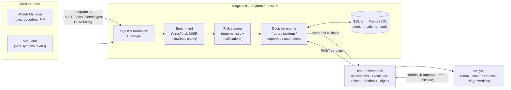

# SOC Alert Triage & Incident Response Automation

**AI-Assisted, defensive SOC automation for L1/L2 alert triage — built with Python, n8n, Wazuh, and Docker.**


> **Project status (honest):** **Phase 2D is complete** — the minimum Docker lab
> (triage-api + n8n + mailpit) builds and runs, and the alert pipeline (ingest →
> normalize → dedupe → enrich → score → decide → notify) is implemented and tested.
> Phase 2D fixes the n8n email notification chain: every Send Email node is bound to
> a provisioned lab SMTP credential (Mailpit), and notification emails render the
> structured payload as readable text (see the [Development Roadmap](#development-roadmap)).
> This is a **portfolio / homelab-grade project**. It is *not* deployed in any production
> SOC, makes **no production claims**, and ships only defensive capabilities.

---

## Table of Contents

1. [Purpose](#purpose)
2. [What This Project Is / Is Not](#what-this-project-is--is-not)
3. [SOC Use Cases](#soc-use-cases)
4. [Architecture Overview](#architecture-overview)
5. [Technologies](#technologies)
6. [Planned Workflow (End to End)](#planned-workflow-end-to-end)
7. [Repository Layout](#repository-layout)
8. [Security Considerations](#security-considerations)
9. [Installation Prerequisites](#installation-prerequisites)
10. [Development Roadmap](#development-roadmap)
11. [Documentation Index](#documentation-index)
12. [Contributing & License](#contributing--license)

---

## Purpose

Small and medium SOCs drown in repetitive alert work: a Wazuh agent flags a brute-force
attempt, an analyst greps logs, checks the source IP on VirusTotal, searches MISP for the
hash, writes the same summary, and closes the ticket — hundreds of times a week. L1
analysts spend most of their day on mechanical enrichment instead of real investigation,
and critical signals get lost in the noise.

This project automates that loop **defensively and transparently**:

- **Ingest** alerts from Wazuh (real manager integration, or safe simulated alerts for
  development/demo).
- **Normalize** them into one canonical alert schema.
- **Enrich** IOCs (IPs, domains, file hashes) via **VirusTotal** (free public API) and a
  self-hosted **MISP** instance, with caching and strict rate limiting.
- **Score** risk with a **deterministic, explainable scoring engine** (rule severity,
  threat-intel verdicts, asset criticality, recurrence) — every score ships a human-readable
  justification, not a black-box number.
- **Decide & route**: auto-open incidents, notify analysts over email/chat via **n8n**
  workflows, escalate on SLA breach, and auto-close low-value noise.
- **Learn from feedback**: analyst false-positive/escalation verdicts feed a tuning dataset
  for future weight adjustment.

## What This Project Is / Is Not

| ✅ This project **is** | ❌ This project **is not** |
| --- | --- |
| A defensive SOC automation & triage platform | An offensive security / attack toolkit |
| A realistic L1/L2 workflow simulator for learning & portfolio use | A claim of production deployment |
| Free-tier friendly (public VirusTotal API, self-hosted MISP, TheHive **CE** optional) | Dependent on any paid service |
| Deterministic and explainable by default (LLM assistance is a later, optional, clearly-labeled phase) | A black-box "AI decides everything" system |
| Human-in-the-loop: destructive response actions require explicit analyst approval | An autonomous retaliation / auto-containment bot |

## SOC Use Cases

| # | Use case | SOC role | Pipeline stages |
| --- | --- | --- | --- |
| UC-1 | SSH brute-force detection → enrichment → risk score → L1 notification | L1 | ingest → enrich → score → route |
| UC-2 | Malicious file hash alert (VT verdict) → high-severity incident + SLA escalation | L1/L2 | ingest → enrich → score → incident |
| UC-3 | File integrity alert on a critical server (`/etc/passwd`) → incident on tier-1 asset | L1/L2 | ingest → score (asset criticality) → incident |
| UC-4 | Alert dedup & recurrence-based escalation (same rule+agent keeps firing) | L1 | normalize → dedupe → score (recurrence) |
| UC-5 | Known-good allowlist suppression (backup servers, vulnerability scanners) | L1 | enrich (allowlist) → suppress/auto-deprioritize |
| UC-6 | Analyst triage verdict capture (true/false positive) → tuning dataset | L2 | feedback → tune |
| UC-7 | Daily digest: volumes, top rules, false-positive rate | L2/manager | report |
| UC-8 | MITRE ATT&CK-tagged alert routing to the right runbook | L1 | score → route |

## Architecture Overview

High-level view (full detail, schemas, and design decisions in
[ARCHITECTURE.md](ARCHITECTURE.md)):



## Technologies

| Technology | Role | Cost |
| --- | --- | --- |
| **Python 3.11+ / FastAPI** | Triage API: ingest, normalize, enrich, score, decide, REST surface | Free |
| **n8n** | Workflow orchestration: notifications, escalation timers, tickets, feedback forms, digests | Free, self-hosted |
| **Wazuh 4.x** | SIEM/XDR: rules, decoders, FIM, agent telemetry — the alert source | Free, self-hosted |
| **MISP** (optional profile) | Self-hosted threat-intel platform for IOC/attribute lookups | Free, self-hosted |
| **VirusTotal** | IOC enrichment (hashes, IPs, domains) | Free public API (4 req/min, 500/day) |
| **TheHive 5 CE** (optional, later) | Case management — Community Edition only, never Premium | Free, self-hosted |
| **LLM API** (optional, later) | Draft triage summaries/suggestions, clearly labeled, deterministic fallback | Free-tier possible |
| **Docker / Docker Compose** | Reproducible multi-service lab with network segmentation | Free |
| **SQLite → PostgreSQL** | Alert/incident/audit persistence (SQLite MVP, Postgres profile) | Free |

## Planned Workflow (End to End)

1. **Ingest** — Wazuh's `integrator` module (or the simulator for demos) POSTs a JSON alert
   to `POST /api/v1/alerts/ingest` with an `X-API-Key` header.
2. **Normalize & dedupe** — the alert maps to a canonical schema; duplicates
   (same rule + agent within a window) increment a recurrence counter instead of creating noise.
3. **Extract & enrich** — IOCs (IPs, domains, MD5/SHA-1/SHA-256) are extracted, then:
   allowlist check → local cache → VirusTotal (rate-limited) → MISP attributes. Any enrichment
   failure degrades gracefully (alert continues, flagged `enrichment: partial`).
4. **Score** — deterministic engine computes 0–100 with tier (info/low/medium/high/critical)
   and a factor-by-factor **justification list**. Weights live in a versioned config file,
   tunable without code changes.
5. **Decide & route** — per the decision matrix: open incident (Sev1/Sev2), queue for L1,
   suppress, or auto-close stale low-value alerts past their TTL.
6. **Notify** — the API calls an n8n webhook; n8n fans out to email (Mailpit sink in the lab)
   and a chat webhook, including enrichment summary, score justification, and runbook link.
7. **Escalate** — if no analyst acknowledgment within the SLA (15 min critical / 30 min high),
   n8n re-notifies and escalates to L2.
8. **Feedback & tune** — the analyst submits a verdict (true positive / false positive /
   escalate) via an n8n form; verdicts are stored, audited, and feed future weight tuning.
9. **Report** — a scheduled n8n digest summarizes volumes, top rules, and FP rate.

## Repository Layout

```
soc-alert-triage-automation/
├── README.md                  # you are here
├── ARCHITECTURE.md            # full system design (components, data flow, schemas)
├── DEVELOPMENT_PLAN.md        # phases, milestones, acceptance criteria, testing strategy
├── SECURITY.md                # security policy, secrets handling, threat model
├── CONTRIBUTING.md            # how to contribute, code style, PR checklist
├── LICENSE                    # MIT
├── .env.example               # environment template — placeholder values only
├── app/                       # Triage API (Python/FastAPI) — scaffolded, built in Phase 1
│   ├── src/soc_triage/        # api · core · models · ingest · enrichment · scoring · decisions · notifications
│   └── tests/                 # unit/ and integration/ suites
├── n8n/                       # exported workflow JSONs + import docs (Phase 1–3)
├── wazuh/                     # manager config, custom rules, integrator script (Phase 4)
├── misp/                      # optional MISP profile notes & seeding guide (Phase 2)
├── deploy/                    # Dockerfiles & compose fragments (Phase 1)
├── docs/
│   ├── sample-alerts/         # safe synthetic Wazuh alert payloads (also test fixtures)
│   ├── runbooks/              # analyst runbooks per scenario (Phase 3)
│   └── diagrams/              # diagram sources
├── scripts/                   # repo hygiene & dev utilities (e.g. check_secrets.sh)
└── data/                      # runtime data volume — git-ignored, never committed
```

## Security Considerations

Summary — full policy in [SECURITY.md](SECURITY.md):

- **Secrets:** only via environment variables; `.env` is git-ignored; `.env.example` ships
  placeholders only; `scripts/check_secrets.sh` scans tracked files for leaked credential
  patterns; optional services are disabled when their keys are empty.
- **Authentication:** ingest requires an `X-API-Key`; n8n↔API callbacks use a shared token;
  upgrade path to HMAC signing and per-source keys is documented.
- **Networks:** services run on internal Docker networks; only n8n and the Triage API publish
  ports; heavier optional services (MISP, Postgres) live behind compose profiles.
- **Data hygiene:** all sample/test data is synthetic; IPs use RFC 5737/3849 documentation
  ranges; no real user, victim, or customer data is ever committed.
- **Defensive only:** no exploit, malware, or attack tooling will be accepted; containment
  actions are human-approved by design.
- **Container hardening:** non-root users, pinned image tags, healthchecks, resource limits.

## Installation Prerequisites

The Docker stack is runnable (Phase 2C complete). You will need:

| Requirement | Version | Purpose |
| --- | --- | --- |
| Docker Engine + Docker Compose | 24+ / v2 | Run the multi-service lab |
| Git | any | Clone this repository |
| Python | 3.11+ (via Docker; locally only for development) | Triage API development & tests |
| A free VirusTotal account | public API key | IOC enrichment (optional) |
| ~4 GB RAM free | — | n8n + triage-api + mailpit stack |

Quick start:

```bash
git clone https://github.com/SadashivPole/soc-alert-triage-automation.git
cd soc-alert-triage-automation
git checkout main
cp .env.example .env
# Set TRIAGE_INGEST_API_KEY and generate a stable N8N_ENCRYPTION_KEY
# (openssl rand -hex 24). Keep that key; changing it on an existing
# n8n-data volume causes an encryption-key mismatch.
docker compose build
docker compose up -d
# Test: POST /api/v1/alerts/ingest with X-API-Key header
```

## Development Roadmap

Full detail with acceptance criteria: [DEVELOPMENT_PLAN.md](DEVELOPMENT_PLAN.md).

| Phase | Focus | Key deliverables | Status |
| --- | --- | --- | --- |
| **0 — Foundation** | Docs & scaffolding | ARCHITECTURE, DEVELOPMENT_PLAN, SECURITY, CONTRIBUTING, README, .env.example, tree | ✅ complete |
| **1 — MVP pipeline** | Core triage loop | FastAPI skeleton, ingest+normalize+dedupe, SQLite models, scoring v1, docker compose (API+n8n+Mailpit), simulator, unit tests | ✅ complete |
| **2 — Enrichment** | Threat intel | VirusTotal client (cache + rate limit), MISP profile, scoring v2 (intel signals), n8n notifications | ✅ complete (2A–2C) |
| **3 — Incidents & UX** | Analyst workflow | Incident records, SLA escalation workflow, feedback endpoint, runbooks, SOC console dashboard | ⬜ |
| **4 — Real Wazuh** | Full integration | Wazuh manager profile, integrator script, custom ruleset, asset inventory, human-approved response runbooks | ⬜ |
| **5 — Optional AI** | LLM assist & tuning | Clearly-labeled LLM triage summaries (deterministic fallback), feedback-driven weight tuning, MITRE mapping | ⬜ |

## Documentation Index

| Document | Contents |
| --- | --- |
| [ARCHITECTURE.md](ARCHITECTURE.md) | Components, data flow, canonical schema, scoring spec, decision matrix, n8n workflows, Docker/network design, ADRs |
| [DEVELOPMENT_PLAN.md](DEVELOPMENT_PLAN.md) | Phased milestones, acceptance criteria, testing strategy, definition of done, risks |
| [SECURITY.md](SECURITY.md) | Security policy, secrets rules, threat model, data policy, vulnerability reporting |
| [CONTRIBUTING.md](CONTRIBUTING.md) | Workflow, style guides, PR checklist, sample-data rules |
| [docs/sample-alerts/README.md](docs/sample-alerts/README.md) | Synthetic alert scenarios & expected triage behavior |

## Contributing & License

- Contributions welcome — see [CONTRIBUTING.md](CONTRIBUTING.md).
- License: [MIT](LICENSE).
- Found a security issue in this project? Please follow the responsible-disclosure
  process in [SECURITY.md](SECURITY.md) — do not open a public issue.
