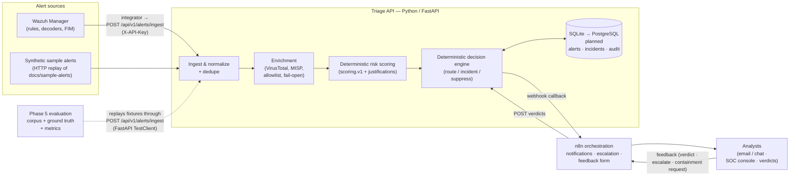
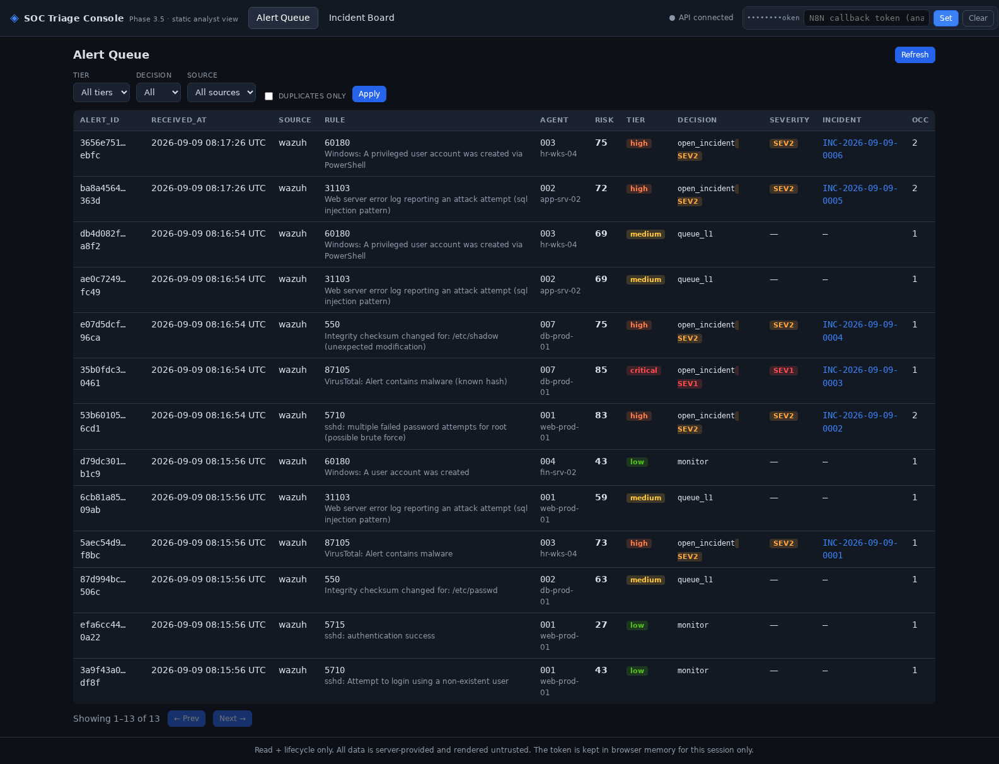
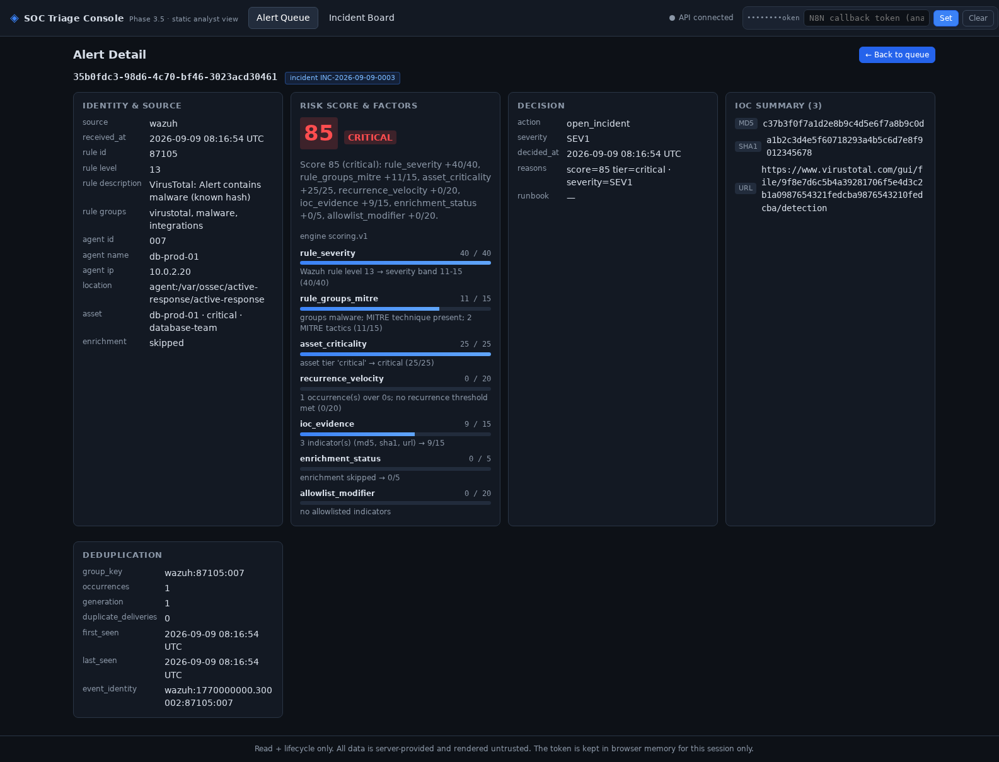
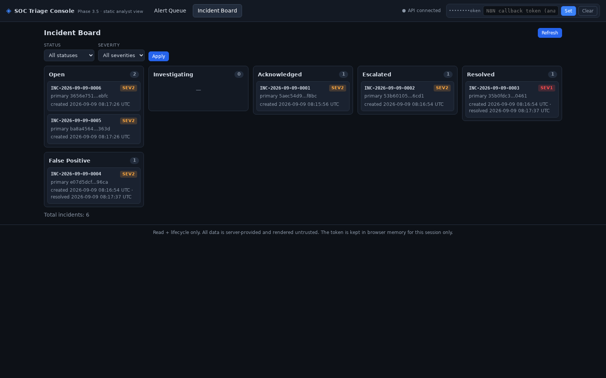
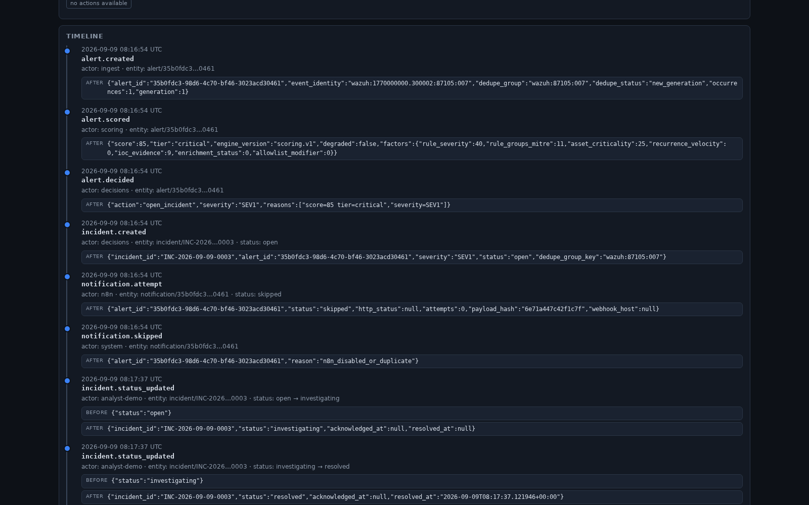

# SOC Alert Triage & Incident Response Automation

**Defensive SOC alert triage and incident-response automation** — a Python/FastAPI triage
API with Wazuh ingestion, deterministic scoring and decision routing, n8n analyst
workflows, and a Docker lab.


> **Project status (honest).** Phase 0 and Phase 1 are complete; Phase 2 and Phase 3 are
> implemented with named items outstanding; **Phase 4 (real Wazuh integration)** is
> implemented and partially live-validated; **Phase 5 (deterministic detection
> evaluation)** is implemented and locally validated; **Phase 6 (detection quality &
> correlation) is planned / in progress with no implementation yet** — see
> [Development Roadmap](#development-roadmap) and
> [DEVELOPMENT_PLAN.md](DEVELOPMENT_PLAN.md).
>
> The **authoritative triage path is deterministic**: alert → ingest → normalize → dedupe
> → enrich → **deterministic risk scoring (`scoring.v1`)** → **deterministic decision
> routing (`decisions.v1`)** → incident / notification / audit. Every score ships a
> factor-by-factor human-readable justification.
>
> **There is no AI/LLM component in this repository.** No AI or LLM participates in any
> score, decision, notification, or response. LLM assistance is **not implemented** — it
> is only an optional, unscheduled future idea that must never be load-bearing (see
> [Optional future functionality](#optional-future-functionality-not-implemented)).
>
> This is a **portfolio / homelab-grade project**. It is **not deployed in any production
> SOC**, makes **no production claims**, and contains defensive capabilities only.

---

## Table of Contents

1. [Status & Evidence Vocabulary](#status--evidence-vocabulary)
2. [Purpose](#purpose)
3. [What This Project Is / Is Not](#what-this-project-is--is-not)
4. [SOC Use Cases](#soc-use-cases)
5. [Architecture Overview](#architecture-overview)
6. [Deterministic Scoring & Decision Routing](#deterministic-scoring--decision-routing)
7. [Phase 5 — Deterministic Detection Evaluation](#phase-5--deterministic-detection-evaluation)
8. [Phase 6 — Detection Quality & Correlation (Planned)](#phase-6--detection-quality--correlation-planned)
9. [Triage Pipeline (End to End)](#triage-pipeline-end-to-end)
10. [Technologies](#technologies)
11. [Repository Layout](#repository-layout)
12. [Testing & CI](#testing--ci)
13. [Security Considerations](#security-considerations)
14. [Installation & Quick Start](#installation--quick-start)
15. [Development Roadmap](#development-roadmap)
16. [SOC Console](#soc-console)
17. [Observability](#observability)
18. [Validation Status & Known Gaps](#validation-status--known-gaps)
19. [Optional Future Functionality (Not Implemented)](#optional-future-functionality-not-implemented)
20. [Documentation Index](#documentation-index)
21. [Contributing & License](#contributing--license)

---

## Status & Evidence Vocabulary

Every status statement in this repository uses one of these six labels. They are used
consistently in this README and in [DEVELOPMENT_PLAN.md](DEVELOPMENT_PLAN.md).

| Label | Meaning |
| --- | --- |
| ✅ **Implemented** | Code/config/docs exist in the repository and are exercised by the default runtime or by automated tests in CI. |
| ✅ **Locally validated** | Actually executed and observed (test suite run, or a documented runtime validation with recorded evidence). |
| 🔍 **Source-audited** | Verified by reading the pinned upstream source/image contents — **not** by running it live. |
| 🟡 **Partially validated** | Implemented and partly exercised; named sub-checks are still outstanding. |
| ⬜ **Outstanding** | Scoped work with no implementation, or implementation without validation. |
| 🔮 **Future / planned** | Not started; explicitly outside the current scope. No code exists. |

**Do not read a ✅ as a production statement.** All validation in this project happened
in a local Docker lab or a test harness; nothing here has been operated as a production
SOC service.

---

## Purpose

Small and medium SOCs drown in repetitive alert work: a Wazuh agent flags a brute-force
attempt, an analyst greps logs, checks the source IP on VirusTotal, searches MISP for the
hash, writes the same summary, and closes the ticket — hundreds of times a week. L1
analysts spend most of their day on mechanical enrichment instead of real investigation,
and critical signals get lost in the noise.

This project automates that loop **defensively and transparently**:

- **Ingest** alerts from Wazuh (real manager `integrator` integration, or any HTTP client
  replaying the synthetic sample alerts).
- **Normalize** them into one canonical alert schema.
- **Enrich** IOCs (IPs, domains, file hashes) via **VirusTotal** (free public API) and a
  self-hosted **MISP** instance. Clients are implemented and **disabled by default**;
  a MISP container profile is still outstanding.
- **Score** risk with a **deterministic, explainable scoring engine** (rule severity,
  rule groups/MITRE presence, asset criticality, recurrence, IOC evidence, enrichment
  corroboration) — every score ships a human-readable justification, not a black-box
  number.
- **Decide & route** with a **deterministic decision matrix**: auto-open incidents,
  queue for L1, monitor, or suppress — with severity (`SEV1`/`SEV2`) on incidents.
- **Notify & escalate** analysts over email/chat through **n8n** workflows, with SLA
  escalation when an alert is not acknowledged.
- **Learn from feedback**: analyst true-positive/false-positive/escalate/containment
  verdicts are stored and audited (weight tuning itself is not implemented).
- **Measure detection quality**: a **labeled evaluation corpus with ground truth**
  produces a real confusion matrix and precision/recall/F1/false-positive-rate from
  runtime scoring (Phase 5).

## What This Project Is / Is Not

| ✅ This project **is** | ❌ This project **is not** |
| --- | --- |
| A **defensive SOC alert triage and incident-response automation** lab | An offensive security / attack toolkit |
| A realistic L1/L2 workflow for learning, portfolio, and interview review | A claim of production deployment |
| Deterministic and explainable by default — scoring/decision routing is the authoritative decision path | An AI-driven decision system (there is no AI/LLM in the codebase) |
| Free-tier friendly (public VirusTotal API, self-hosted MISP, no paid dependency) | Dependent on any paid service |
| Human-in-the-loop: destructive response actions are proposals that require explicit analyst approval | An autonomous retaliation / auto-containment bot |
| Backed by 891 Python tests + 15 console JS tests and a Phase 5 evaluation harness | A benchmark of detection quality (the evaluation corpus is a 6-fixture smoke corpus) |

## SOC Use Cases

Status is per the [vocabulary above](#status--evidence-vocabulary) and reflects the
current tree, not intent.

| # | Use case | SOC role | Pipeline stages | Status |
| --- | --- | --- | --- | --- |
| UC-1 | SSH brute-force detection → enrichment → risk score → L1 notification | L1 | ingest → enrich → score → route → notify | ✅ implemented |
| UC-2 | Malicious file hash alert (VT verdict) → high-severity incident + SLA escalation | L1/L2 | ingest → enrich → score → incident → escalate | ✅ implemented (VirusTotal path tested with fake transports only) |
| UC-3 | File integrity alert on a critical server (`/etc/passwd`) → incident on tier-1 asset | L1/L2 | ingest → score (asset criticality) → incident | ✅ implemented |
| UC-4 | Alert dedup & recurrence-based escalation (same rule+agent keeps firing) | L1 | normalize → dedupe → score (recurrence) | ✅ implemented |
| UC-5 | Known-good allowlist suppression (backup servers, vulnerability scanners) | L1 | enrich (allowlist) → suppress | 🟡 engines honor allowlist matches; the allowlist/asset-inventory loader that produces them is ⬜ outstanding |
| UC-6 | Analyst triage verdict capture (true/false positive) → tuning dataset | L2 | feedback → tune | 🟡 feedback capture ✅ implemented; automated weight tuning ⬜ outstanding |
| UC-7 | Daily digest: volumes, top rules, false-positive rate | L2/manager | report | ⬜ outstanding (no digest workflow or stats endpoint) |
| UC-8 | MITRE ATT&CK-tagged alert routing to the right runbook | L1 | score → route | ⬜ outstanding (ATT&CK tags flow through from Wazuh rule metadata and influence the score; runbook linkage is not implemented — Phase 6) |

## Architecture Overview

High-level view (full detail, schemas, and design decisions in
[ARCHITECTURE.md](ARCHITECTURE.md)):



## Deterministic Scoring & Decision Routing

**This is the authoritative decision path.** Nothing else decides anything: enrichment
can only contribute bounded corroboration points, and no external service, model, or
human-authored heuristic participates in the numeric score or the routing decision.

| Layer | Where it lives | Behavior |
| --- | --- | --- |
| Scoring policy | [`app/config/scoring.yaml`](app/config/scoring.yaml) — `engine_version: scoring.v1` | Schema-validated, versioned, reviewable diff. Seven capped factors: `rule_severity` (0–40), `rule_groups_mitre` (0–15), `asset_criticality` (0–25), `recurrence_velocity` (0–20), `ioc_evidence` (0–15), `enrichment_status` (0–5), `allowlist` (−20). Score is clamped to 0–100 with `informational / low / medium / high / critical` tier bands. |
| Scoring engine | [`app/src/soc_triage/scoring/engine.py`](app/src/soc_triage/scoring/engine.py) | **Pure function**, no I/O, no clock, no network: the same alert + policy always yields the same score, tier, factor breakdown, and summary text. Unavailable enrichment contributes 0 (fail-safe). |
| Decision policy | [`app/config/decisions.yaml`](app/config/decisions.yaml) — `policy_version: decisions.v1` | Tier → action matrix: `informational`/`low` → `monitor`, `medium` → `queue_l1`, `high` → `open_incident` (`SEV2`), `critical` → `open_incident` (`SEV1`), allowlisted source → `suppress`. |
| Decision engine | [`app/src/soc_triage/decisions/router.py`](app/src/soc_triage/decisions/router.py) | Pure function over `(RiskAssessment, CanonicalAlert, DecisionPolicy)`; returns the action, optional severity, and human-readable reasons. **It performs no response action** — containment is a proposal that requires explicit analyst approval and is audit-logged. |

Golden-file tests pin the sample-alert scores, and any weight change is an intentional,
reviewable diff accompanied by a golden update.

## Phase 5 — Deterministic Detection Evaluation

**Status: ✅ implemented and locally validated.** No production or benchmark claims.

Phase 5 adds a labeled evaluation framework that replays fixtures through the **real
ingest API** (FastAPI `TestClient`, temp SQLite, real normalizer → dedupe → scoring →
decision path) and measures the deterministic output against ground truth.

| Artifact | What it is |
| --- | --- |
| [`evaluation/corpus.json`](evaluation/corpus.json) | **Labeled evaluation corpus** (version `1.0`): 6 fixtures from `app/tests/fixtures/`, each labeled `positive` (5) or `negative` (1) with a short reason. |
| [`evaluation/ground_truth.json`](evaluation/ground_truth.json) | **Ground truth** (version `1.0`): the expected `score`, `tier`, and decision `action` per fixture (`severity` is additionally pinned for the malware fixture), plus analyst notes. All six fixtures currently carry the implicit `verified` score contract; the loader/evaluator also supports an `unverified` contract that reports a fixture as `partial` rather than pass/fail. |
| [`evaluation/metrics.py`](evaluation/metrics.py) | **Confusion matrix + metrics**: a frozen `ConfusionMatrix` (TP/FP/FN/TN) dataclass and `calculate_metrics()` returning **precision**, **recall**, **F1**, and **false-positive rate** with safe zero-division handling. |
| [`evaluation/evaluator.py`](evaluation/evaluator.py) | Offline helper API — ground-truth loading, `compare_expected`, `evaluate_fixture`, `summarize`, plus a CLI status report (`python evaluation/evaluator.py`). It is not invoked by CI; the runtime comparison lives in the test harness. |
| [`app/tests/evaluation/test_evaluation.py`](app/tests/evaluation/test_evaluation.py) | **Runtime evaluation tests** (2 tests, run on every CI push/PR as part of `pytest`): every corpus fixture is POSTed to `/api/v1/alerts/ingest`; measured `risk.score` / `risk.tier` / `decision.action` / `decision.severity` are compared to ground truth; a positive/negative classification maps to TP/FP/FN/TN; the confusion matrix and metrics are printed; ground-truth contract failures fail the test; a second test asserts corpus ↔ ground-truth fixture parity. |

**How to run it:**

```bash
cd app
pytest tests/evaluation -q -s        # prints the confusion matrix + metrics
python ../evaluation/evaluator.py    # offline ground-truth contract status report
```

**Measured baseline on the current 6-fixture corpus** (printed by the harness; verified
locally on Python 3.11, 2026-09-10):

| Fixture | Corpus label | Measured action (deterministic) | Classification |
| --- | --- | --- | --- |
| `01_wazuh_ssh_brute_force.json` | positive | `monitor` | FN |
| `02_wazuh_ssh_brute_force_success.json` | negative | `monitor` | TN |
| `03_wazuh_fim_etc_passwd_change.json` | positive | `queue_l1` | TP |
| `04_wazuh_malware_hash_virustotal.json` | positive | `open_incident` | TP |
| `05_wazuh_web_sql_injection.json` | positive | `queue_l1` | TP |
| `06_wazuh_windows_user_created.json` | positive | `queue_l1` | TP |

> Confusion matrix: **TP 4 · FP 0 · FN 1 · TN 1** → precision **1.0000**, recall
> **0.8000**, F1 **0.8889**, false-positive rate **0.0000**.
>
> The single FN is a **label/action-mapping observation, not a scoring change**: the
> corpus labels the first-occurrence SSH brute-force fixture `positive`, while the
> deterministic engine scores it `43 / low → monitor` (recurrence is what escalates, and
> the fixture's own ground-truth contract passes). The harness counts
> `queue_l1`/`open_incident` as positive actions and `monitor`/`suppress` as negative
> actions, so this fixture lands as FN. Resolving that semantics belongs to the Phase 6
> expanded regression corpus.

**What Phase 5 does *not* do:** it does not assert the metric values (they are printed,
so there is **no detection-quality CI gate yet** — that is Phase 6); it does not measure
enrichment quality (all fixtures run with enrichment disabled/skipped); it does not cover
Wazuh rule-level detection coverage; and a 6-fixture corpus is **not** a benchmark.

## Phase 6 — Detection Quality & Correlation (Planned)

**Status: 🔮 planned / in progress — nothing in this section is implemented.** It is
recorded here so the roadmap and the repository state cannot drift apart.

| Phase 6 item | Intent | Current state |
| --- | --- | --- |
| **Detection coverage framework** | Track which Wazuh rules/decoders and scenarios the platform actually covers, and which are blind spots | 🔮 not started (no coverage artifact exists) |
| **ATT&CK mapping** | Map detected scenarios to MITRE ATT&CK techniques for reporting and analyst context | 🔮 not started as a mapping framework. Today ATT&CK ids only pass through from Wazuh rule metadata as `rule.mitre`, and their *presence* contributes to the `rule_groups_mitre` score factor |
| **Expanded regression corpus** | Grow the labeled corpus well beyond 6 fixtures (incl. label/action semantics such as UC-1's first-occurrence case) | 🔮 not started; current corpus is 6 fixtures / 1 negative |
| **Cross-alert correlation** | Correlate related alerts (same host/user/indicator over time) into a single investigation context | 🔮 not started; dedupe groups by rule+agent recurrence only |
| **Analyst explainability** | Extend per-alert explanations so an analyst can see why an alert mattered and what changed | 🔮 not started beyond today's factor-by-factor score justification, decision reasons, and incident timeline |
| **Detection-quality CI gates** | Fail CI when precision/recall/F1 regress beyond a threshold | 🔮 not started; the Phase 5 harness prints metrics but asserts none of them |

## Triage Pipeline (End to End)

Status markers describe the current tree.

1. ✅ **Ingest** — Wazuh's `integrator` module (`wazuh/integrator/custom-triage`) POSTs
   alert JSON to `POST /api/v1/alerts/ingest` with an `X-API-Key` header. The synthetic
   sample alerts in `docs/sample-alerts/` (also the test fixtures) can be replayed with
   any HTTP client. ⬜ A convenience replay script (`scripts/send_test_alert`) is **not**
   implemented.
2. ✅ **Normalize & dedupe** — the alert maps to a canonical schema; repeats
   (same rule + agent within a window) increment a recurrence counter instead of creating
   noise, with persisted idempotency records for duplicate deliveries.
3. 🟡 **Extract & enrich** — IOCs (IPv4, domain, URL, MD5/SHA-1/SHA-256, email) are
   extracted by a pure function, then the provider chain runs
   `noop → VirusTotal → MISP`. Both real providers are **disabled by default**
   (`VIRUSTOTAL_API_KEY` / `MISP_URL`+`MISP_API_KEY` empty ⇒ disabled) and are exercised
   only through `httpx.MockTransport` fakes, with token-bucket rate limiting and bounded
   retries. Any failure degrades gracefully (fail-open, `enrichment_status` recorded).
   ⬜ Outstanding: response TTL cache, static allowlist/asset-inventory loader, MISP
   container profile + seeding guide, late-enrichment re-score.
4. ✅ **Score** — deterministic engine computes 0–100, a tier, and a factor-by-factor
   justification list; weights live in the versioned config file.
5. ✅ **Decide & route** — per the decision matrix: open incident (`SEV1`/`SEV2`), queue
   for L1, monitor, or suppress allowlisted sources. No autonomous response action.
6. ✅ **Notify** — the API calls an n8n webhook; n8n fans out to email (Mailpit sink in
   the lab) including score justification, recurrence, IOC/enrichment summaries, and
   investigation links.
7. ✅ **Escalate** — the exported escalation workflow (WF3) waits **15 minutes** for an
   acknowledgment (checked read-only via `GET /api/v1/alerts/{id}/feedback/status`), then
   re-notifies and escalates to L2, failing safe (escalate) if the status endpoint errors.
   The design table documents 15 min for critical and 30 min for high; only the 15-minute
   wait is implemented in the exported workflow today.
8. 🟡 **Feedback** — the analyst submits a verdict (true positive / false positive /
   benign / escalate / acknowledged / resolved / contain_requested) via the n8n form or
   the API; verdicts are stored, audited, and drive incident transitions.
   `contain_requested` records an **approval-required request** and executes nothing.
   ⬜ Automated weight tuning from feedback is not implemented.
9. ⬜ **Report** — a scheduled digest (volumes, top rules, FP rate) is designed but not
   implemented; there is no stats endpoint and no digest workflow.
10. ✅ **Incident lifecycle & console** — incidents persist with a state machine,
    read APIs, timeline, and TTL auto-close sweeper; the static SOC console provides the
    analyst queue/board/detail views.

## Technologies

| Technology | Role | Status in this repo | Cost |
| --- | --- | --- | --- |
| **Python 3.11+ / FastAPI** | Triage API: ingest, normalize, dedupe, enrich, score, decide, REST surface | ✅ implemented (CI on 3.11 & 3.12) | Free |
| **n8n 1.85.0** | Workflow orchestration: notification fan-out, SLA escalation, analyst feedback form | ✅ WF1/WF2/WF3/WF5 exported + import helper (⬜ WF6 digest) | Free, self-hosted |
| **Wazuh 4.9.2** | SIEM/XDR: rules, decoders, FIM, agent telemetry — the alert source | 🟡 `full` profile + integrator implemented, live-validated end-to-end; custom ruleset authored but not live-validated | Free, self-hosted |
| **MISP** | Self-hosted threat-intel platform for IOC attribute lookups | 🟡 provider implemented (disabled by default); container profile + seeding guide ⬜ outstanding | Free, self-hosted |
| **VirusTotal public API** | IOC enrichment (hashes, IPs, domains, URLs) | 🟡 client implemented with rate limiting/retries (disabled by default, fake-transport tested only) | Free public tier (4 req/min, 500/day) |
| **Prometheus + Grafana** | Optional read-only observability profile (`observability`) | ✅ implemented and runtime-validated in the lab | Free, self-hosted |
| **TheHive 5 CE** | Case-management export | ⬜ outstanding (optional; CE only, never Premium) | Free, self-hosted |
| **SQLite / Alembic** | Alert/incident/audit persistence with automatic migrations | ✅ implemented | Free |
| **PostgreSQL** | Production-shaped database profile | ⬜ outstanding (a compose profile is designed, not implemented) | Free |
| **Docker / Docker Compose** | Reproducible multi-service lab with network segmentation | ✅ implemented | Free |
| **LLM API** | Draft triage summaries | 🔮 **not implemented** — optional future idea only; `.env.example` carries unused placeholders | Free-tier possible |

## Repository Layout

```
soc-alert-triage-automation/
├── README.md                  # you are here
├── ARCHITECTURE.md            # full system design (components, data flow, schemas, ADRs)
├── DEVELOPMENT_PLAN.md        # phased roadmap, statuses, acceptance criteria, testing strategy
├── SECURITY.md                # security policy, secrets handling, threat model
├── CONTRIBUTING.md            # how to contribute, code style, PR checklist
├── CHANGELOG.md               # phase-by-phase change history
├── LICENSE                    # MIT
├── .env.example               # environment template — placeholder values only
├── app/                       # Triage API (Python/FastAPI)
│   ├── src/soc_triage/        # api · core · models · ingest · enrichment · scoring · decisions · notifications
│   ├── console/               # static SOC console (Phase 3.5): index.html · styles.css · console.js · console-core.js
│   ├── config/                # scoring.yaml (scoring.v1) · decisions.yaml (decisions.v1)
│   ├── alembic/               # migrations
│   └── tests/                 # unit/ · integration/ · evaluation/ · js/ · fixtures/
├── evaluation/                # Phase 5 evaluation framework: corpus.json · ground_truth.json · metrics.py · evaluator.py
├── n8n/                       # exported workflow JSONs (WF1/WF2/WF3/WF5) + import docs + lab SMTP credential template
├── wazuh/                     # manager config, custom rules/decoders, integrator script, entrypoint hook (Phase 4)
├── misp/                      # optional MISP profile notes — scaffolded only
├── deploy/                    # triage-api Dockerfile, Prometheus/Grafana provisioning
├── docs/
│   ├── sample-alerts/         # safe synthetic Wazuh alert payloads (also test fixtures)
│   ├── runbooks/              # analyst runbooks for the six sample scenarios (Phase 3.6)
│   ├── screenshots/           # console screenshots
│   └── specs/                 # phase specifications (Phase 3.7 observability, Phase 4 validation checklist)
├── scripts/                   # repo hygiene & dev utilities (check_secrets.sh, n8n-import-workflows.sh)
└── data/                      # runtime data volume — git-ignored, never committed
```

## Testing & CI

**Verified locally on this checkout (Python 3.11): `pytest` → 891 passed**
(571 unit, 318 integration, 2 evaluation) and
`node --test app/tests/js/console_core.test.cjs` → **15 passed**.

| Layer | Tooling | Gate |
| --- | --- | --- |
| Unit (scoring, normalizer, dedupe, decisions, config, integrator) | pytest + golden files | core packages; zero golden drift without an explicit golden update in the same PR |
| Contract (sample alerts ↔ normalizer/scorer) | pytest fixtures from `app/tests/fixtures/` | all samples parse and score |
| Integration (API + temp SQLite + auth + audit + lifecycle) | FastAPI `TestClient` | all acceptance-path tests green |
| External fakes (VirusTotal/MISP behavior) | `httpx.MockTransport` injected clients — no network in tests | outage/quota/timeout paths covered |
| **Evaluation (Phase 5)** | pytest + `evaluation/` corpus, ground truth, metrics | ground-truth contracts and corpus/ground-truth parity must hold (metric *values* are printed, not asserted) |
| Console JS | Node `--test` | 15 tests green |
| Security | `scripts/check_secrets.sh`, metrics no-secret canary, authz tests | all green |
| E2E compose smoke | compose + curl assertions | ⬜ **not implemented** — no nightly compose smoke job exists |

`.github/workflows/ci.yml` runs three jobs on every push to `main`, every PR, and
manually: **python-checks** (ruff lint, ruff format check, mypy, pytest on Python 3.11
and 3.12), **secret-scan** (`scripts/check_secrets.sh`), and **console-js-tests**
(Node 22). A coverage percentage threshold is documented in the plan but **not enforced
by CI** today (no `--cov` invocation).

## Security Considerations

Summary — full policy in [SECURITY.md](SECURITY.md):

- **Secrets:** only via environment variables; `.env` is git-ignored; `.env.example`
  ships placeholders only; `scripts/check_secrets.sh` scans tracked files for leaked
  credential patterns and runs in CI; optional services are disabled when their keys are
  empty.
- **Authentication:** ingest requires an `X-API-Key`; n8n↔API callbacks use a shared
  token with constant-time comparison; the Prometheus scrape surface can require its own
  dedicated bearer token; the console keeps its token in browser memory only.
- **Networks:** services run on internal Docker networks; only the services that need
  host access publish ports (Prometheus is never host-published; the Wazuh API on 55000
  is never host-visible).
- **Data hygiene:** all sample/test data is synthetic; IPs use RFC 5737/3849 documentation
  ranges; no real user, victim, or customer data is committed.
- **Defensive only:** no exploit, malware, or attack tooling will be accepted; containment
  actions are human-approved proposals by design, and no autonomous destructive action
  exists anywhere in the codebase.
- **Container hardening:** non-root users, pinned image tags, healthchecks, resource
  limits, `no-new-privileges`, read-only repo mounts.

## Installation & Quick Start

The Docker stack runs (default profile: `triage-api` + `n8n` + `mailpit`). You will need:

| Requirement | Version | Purpose |
| --- | --- | --- |
| Docker Engine + Docker Compose | 24+ / v2 | Run the multi-service lab |
| Git | any | Clone this repository |
| Python | 3.11+ (via Docker; locally only for development/tests) | Triage API development & tests |
| A free VirusTotal account | public API key | IOC enrichment (optional — empty key = disabled) |
| ~4 GB RAM free | — | n8n + triage-api + mailpit stack |

```bash
git clone https://github.com/SadashivPole/soc-alert-triage-automation.git
cd soc-alert-triage-automation
cp .env.example .env
# Set TRIAGE_INGEST_API_KEY and generate a stable N8N_ENCRYPTION_KEY
# (openssl rand -hex 24). Keep that key; changing it on an existing
# n8n-data volume causes an encryption-key mismatch.
docker compose build
docker compose up -d
# Test: POST /api/v1/alerts/ingest with an X-API-Key header
```

Optional profiles (strictly additive — the default stack is unchanged):

```bash
docker compose --profile observability up -d   # Prometheus + Grafana (lab)
docker compose --profile full up -d            # + real Wazuh manager 4.9.2 (lab)
```

## Development Roadmap

Full detail, acceptance criteria, and evidence per phase:
[DEVELOPMENT_PLAN.md](DEVELOPMENT_PLAN.md).

| Phase | Focus | Status | Key evidence / what is missing |
| --- | --- | --- | --- |
| **Phase 0 — Foundation** | Docs & scaffolding | ✅ implemented · locally validated | ARCHITECTURE, DEVELOPMENT_PLAN, SECURITY, CONTRIBUTING, README, `.env.example`, directory tree, `check_secrets.sh` |
| **Phase 1 — MVP triage pipeline** | Core triage loop | ✅ implemented · locally validated | FastAPI app, ingest + normalize + dedupe, SQLite models + Alembic, scoring v1, decisions v1, n8n webhook client, compose (API+n8n+Mailpit), unit/integration tests. ⬜ `scripts/send_test_alert` simulator not implemented |
| **Phase 2 — Enrichment & threat intelligence** | Threat intel | 🟡 partially validated | VirusTotal + MISP providers, IOC extractor, fail-open chain, rate limiting/retries; ⬜ MISP container profile + seeding, static allowlist/asset-inventory loader, TTL cache, scoring v2 intel factor, late-enrichment re-score |
| **Phase 3 — Incidents, analyst workflow & observability** | Analyst loop | 🟡 partially validated | Incidents (3.1), lifecycle + feedback (3.2), read APIs + timeline (3.3), TTL sweeper (3.4), static console (3.5), runbooks (3.6), Prometheus `/metrics` + optional Grafana (3.7); ⬜ Postgres profile (3.8), stats endpoints + digest (3.9) |
| **Phase 4 — Real Wazuh integration & approved response** | Full integration | 🟡 partially validated | Source-audited + live-validated `full` profile and `custom-triage` integrator (4.1/4.2), agent enrollment validated (4.4), custom rules/decoders authored (4.3, not live-validated); ⬜ approval/containment runbook (4.5), TheHive CE export (4.6), failure-spool + duplicate-delivery runtime checks and 10k/day soak (4.7) |
| **Phase 5 — Deterministic detection evaluation** | Detection quality measurement | ✅ implemented · locally validated | Labeled corpus, ground truth, confusion matrix, precision/recall/F1/FPR, runtime evaluation tests replaying fixtures through the real ingest path |
| **Phase 6 — Detection quality & correlation** | Coverage & correlation | 🔮 planned / in progress | ⬜ detection coverage framework, ATT&CK mapping, expanded regression corpus, cross-alert correlation, analyst explainability, detection-quality CI gates |

No release tags have been cut: `CHANGELOG.md` is still under `[Unreleased]` and the Python
package version is `0.1.0a1`.

## SOC Console

A lightweight, **static** analyst console is served by the API at
`http://localhost:8000/console/` (Phase 3.5). It needs no build step or extra container —
`app/console/` is mounted same-origin by `triage-api`
(see [app/console/README.md](app/console/README.md) and
[ARCHITECTURE.md §21](ARCHITECTURE.md)).

Three views, all backed by the existing authenticated read/lifecycle APIs:

1. **Alert Queue** — `GET /api/v1/alerts` with pagination + filters (tier / severity /
   source / duplicate). Dense table: alert id, received time, source, rule, agent, risk
   score + tier, decision + severity, incident linkage, dedupe occurrences.
2. **Alert Detail / score drill-down** — `GET /api/v1/alerts/{alert_id}`. Shows metadata,
   source/rule/agent/asset/location, the **server-provided** risk score + factor breakdown
   (the console never recomputes a score), decision + reasons, dedupe, IOC summary, and
   enrichment status.
3. **Incident Board / Incident Detail** — `GET /api/v1/incidents` grouped into Open /
   Investigating / Acknowledged / Escalated / Resolved / False-positive; drill-down to
   `GET /api/v1/incidents/{id}` and its read-only
   `GET /api/v1/incidents/{id}/timeline`. Lifecycle actions reuse
   `PATCH /api/v1/incidents/{id}/status` and offer **only** the transitions the backend
   state machine allows.

**Authentication:** paste the shared N8N callback token into the top bar; it is kept
**in browser memory only** for the session and sent as `X-N8N-Token`. No token is
hardcoded or persisted. (A dedicated analyst/read token is deferred — the console
documents this rather than weakening backend authz.)

**Screenshots** (local lab, Phase 3.5 console):

| View | Screenshot |
| --- | --- |
| Alert Queue |  |
| Alert Detail / risk drill-down |  |
| Incident Board |  |
| Incident Timeline |  |

## Observability

Phase 3.7 adds an **optional, self-hosted, read-only** observability surface for the lab.
Nothing here is required to run the pipeline, and no production deployment is claimed.

**`GET /metrics`** on the Triage API (`http://localhost:8000/metrics`, same origin as
`/health`) exposes a bounded, app-scoped metric catalog in Prometheus text exposition
format (`text/plain; version=0.0.4; charset=utf-8`):

- Enabled by default (`METRICS_ENABLED=1`). With `METRICS_ENABLED=false` the route is
  **not mounted at all** (requests return 404) and no metrics are recorded.
- Optional bearer auth: `METRICS_SCRAPE_TOKEN` **empty** = authentication disabled
  (development default); when set, scrapers must send `Authorization: Bearer <token>`
  (constant-time check, never logged). It is a dedicated token — ingest/N8N tokens are
  never reused.
- All metrics are prefixed `soc_triage_` and labeled only from fixed enums/route
  templates; counters and histograms are recorded at existing decision points and are
  **non-load-bearing** — they never change scores, decisions, responses, or audit rows.
  Full catalog and cardinality contract:
  [docs/specs/phase-3.7-prometheus-observability.md](docs/specs/phase-3.7-prometheus-observability.md).

**Optional Prometheus + Grafana profile** — additive only; the default stack is
unchanged:

```bash
docker compose up -d                          # default lab (triage-api + n8n + mailpit)
docker compose --profile observability up -d  # + Prometheus + Grafana (lab)
```

- Prometheus (`prom/prometheus:v3.5.0`) scrapes `http://triage-api:8000/metrics`
  internally on `soc-core` every **15 s**; **port 9090 is never published** to the host.
- Grafana (`grafana/grafana:12.1.0`) publishes **port 3000 for lab access only** and is
  provisioned with the Prometheus datasource plus a 13-panel `soc-triage-observability`
  dashboard built only from the approved metric catalog.
- No secrets live in the checked-in config; if you set `METRICS_SCRAPE_TOKEN`, the
  Prometheus container's entrypoint injects it as a runtime-only credential file (never
  committed, never inlined). See [deploy/README.md](deploy/README.md) and
  [ARCHITECTURE.md §13](ARCHITECTURE.md#13-docker--deployment-architecture).

> **Validation note:** the observability profile was runtime-validated on Windows Docker
> Desktop — `triage-api` (`/health`, `/ready`, `/metrics` all 200), Prometheus
> (`triage-api:8000/metrics` UP, 15 s scrape, port 9090 not host-published), and Grafana
> (localhost:3000, Phase 3.7 dashboard loading with metrics populated) all verified
> healthy. That validation predates the Phase 4 Wazuh work; the follow-up check that
> `/metrics` exposes no new families and no Wazuh data remains ⬜ outstanding.

## Validation Status & Known Gaps

Consolidated, evidence-based view of where the project really stands.

**✅ Implemented and locally validated (automated tests, CI):** ingest/normalize/dedupe,
SQLite persistence + migrations, audit log, deterministic scoring `scoring.v1`,
deterministic decisions `decisions.v1`, incident persistence/lifecycle/read APIs/timeline,
TTL auto-close sweeper, analyst feedback capture + incident transitions, n8n workflow
exports with static validation, the static SOC console (+ 15 JS tests), Prometheus
`/metrics`, and the **Phase 5 evaluation framework** (891 Python tests total).

**🔍 Source-audited (not live-run in the build environment):** the Phase 4 Wazuh wiring —
the pinned `wazuh/wazuh-manager:4.9.2` image behaviour, `integratord` log redirection,
integrator install path/ownership, and the `ossec.conf` mount path. Three defects found
this way were fixed (documented in `CHANGELOG.md` and
[docs/specs/phase-4-live-validation-checklist.md](docs/specs/phase-4-live-validation-checklist.md)).
The custom rules/decoders in `wazuh/ruleset/` are **authored and mounted read-only but
have not been exercised against a live rule match**.

**🟡 Partially validated:**

- **Phase 4.1/4.2 + 4.4** — live-validated end-to-end by the maintainer on Windows/Docker
  Desktop (2026-09-06): real Windows agent enrolled and active, a real Wazuh alert
  forwarded (`status=202`), scored (`38`/`low`/`monitor`), and delivered to n8n (HTTP 200).
- **Phase 2 enrichment** — provider logic is exercised only with fake HTTP transports; no
  live VirusTotal or MISP lookup has been recorded, and no allowlist provider exists yet.
- **n8n workflows** — exported JSON, import helper, and static/security tests pass; the
  runtime notification chain was validated in the lab (Mailpit), but there is no
  automated n8n execution test in CI.
- **Observability** — runtime-validated for Phase 3.7, with the post-Phase-4 `/metrics`
  hygiene re-check outstanding.

**⬜ Outstanding (scoped, not done):** `scripts/send_test_alert` simulator; MISP compose
profile + seeding guide; static allowlist/asset-inventory loader; enrichment TTL cache;
scoring v2 threat-intel factor; late-enrichment re-score; PostgreSQL profile; stats
endpoints + daily digest workflow (WF6); runbook linkage from decisions; TheHive CE
export; containment approval/response runbook; Phase 4 failure-spool, duplicate-delivery,
`/metrics` hygiene, and 10k alerts/day soak validations; CI coverage threshold and nightly
compose smoke job.

**🔮 Future / planned:** everything in Phase 6 (detection coverage framework, ATT&CK
mapping, expanded regression corpus, cross-alert correlation, analyst explainability,
detection-quality CI gates).

**Known documentation drift outside this README/plan** (tracked, not fixed here):
`ARCHITECTURE.md §8.3` still refers to "optional LLM polish in Phase 5", but Phase 5 is
now the deterministic evaluation phase and no LLM exists; `app/README.md` still declares
"Status: Phase 1E"; `docs/sample-alerts/README.md` documents a `scripts/send_test_alert`
script that is not implemented; `CHANGELOG.md` has no Phase 5 entry yet.

## Optional Future Functionality (Not Implemented)

- **LLM/AI assistance** — a clearly-labeled, optional drafting aid for analyst-facing
  summaries is an idea only. **Nothing is implemented**: there is no LLM module, no
  provider client, and no AI code path. `.env.example` contains unused `LLM_*`
  placeholders. If it is ever built, it must be off by default, non-load-bearing, and
  strictly additive: scores, tiers, decisions, routing, and audit rows must remain
  byte-identical with it disabled or enabled (ADR-5 in `ARCHITECTURE.md`).
- **TheHive CE case export** (optional), **PostgreSQL profile**, and **daily digest**
  remain additive lab conveniences with no implementation today.

## Documentation Index

| Document | Contents |
| --- | --- |
| [DEVELOPMENT_PLAN.md](DEVELOPMENT_PLAN.md) | Phase-by-phase roadmap with per-item status, acceptance criteria, validation evidence, testing strategy, risks |
| [ARCHITECTURE.md](ARCHITECTURE.md) | Components, data flow, canonical schema, scoring spec, decision matrix, n8n workflows, Docker/network design, ADRs |
| [SECURITY.md](SECURITY.md) | Security policy, secrets rules, threat model, data policy, vulnerability reporting |
| [CONTRIBUTING.md](CONTRIBUTING.md) | Workflow, style guides, PR checklist, sample-data rules |
| [CHANGELOG.md](CHANGELOG.md) | Phase-by-phase change history (Phases 1A–4.2; Phase 5 entry pending) |
| [app/console/README.md](app/console/README.md) | Static SOC console: run, API dependency, auth expectation, limitations, security |
| [docs/sample-alerts/README.md](docs/sample-alerts/README.md) | Synthetic alert scenarios & expected triage behavior |
| [docs/runbooks/README.md](docs/runbooks/README.md) | Analyst runbooks for the six sample scenarios (investigation + approval-gated containment proposals) |
| [docs/specs/phase-3.7-prometheus-observability.md](docs/specs/phase-3.7-prometheus-observability.md) | Phase 3.7 spec: `/metrics` catalog, cardinality/security rules, observability profile, decisions |
| [docs/specs/phase-4-live-validation-checklist.md](docs/specs/phase-4-live-validation-checklist.md) | Phase 4.1/4.2 live-validation checklist: methodology, verified items, outstanding items |

## Contributing & License

- Contributions welcome — see [CONTRIBUTING.md](CONTRIBUTING.md).
- License: [MIT](LICENSE).
- Found a security issue in this project? Please follow the responsible-disclosure
  process in [SECURITY.md](SECURITY.md) — do not open a public issue.
