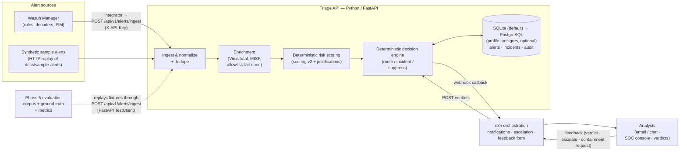

# SOC Alert Triage & Incident Response Automation

**Defensive SOC alert triage and incident-response automation** — a Python/FastAPI triage
API with Wazuh ingestion, deterministic scoring and decision routing, n8n analyst
workflows, and a Docker lab.


## What You Can Do With This Project

- Ingest Wazuh alerts (or replay synthetic samples), then normalize, deduplicate, and track recurrence.
- Explore optional VirusTotal/MISP IOC enrichment; provider clients are disabled by default, and MISP has not been live-validated.
- Inspect deterministic scores and factor explanations, then deterministic routes to monitor, queue for L1, suppress allowlisted sources, or open an incident.
- Use n8n workflows for notifications, escalation, and feedback capture; review incident and audit history.
- Evaluate labeled scenarios against ground truth with confusion-matrix metrics and CI quality gates. The corpus is not a benchmark.
- Run the Docker Compose lab.

**Designed for:** SOC learning, portfolio projects, interview demonstrations, and homelab experimentation.

## 60-Second Overview

Wazuh alert or sample → FastAPI ingest → normalize + deduplicate → optional IOC enrichment → explainable deterministic score → deterministic route → incident/audit records → n8n analyst workflows

Feedback is captured and audited; it does not automatically tune scoring. Containment is an approval-required request, and execution is not implemented.

Detection-quality evaluation is a separate labeled-corpus replay through the ingest path, compared with ground truth and checked by CI quality gates.

> **Project status (honest).** Phase 0 and Phase 1 are complete. **Phase 2 is implemented · locally validated** — Phase 2.2 (static local policy wiring: allowlist `allowlist.v1` + asset inventory `asset_inventory.v1`), Phase 2.3 (enrichment response TTL cache), Phase 2.5 (deterministic `scoring.v2` `threat_intel` factor), Phase 2.6 (late-enrichment re-score), Phase 2.7A (automatic late-enrichment sweep, disabled by default, idempotent), and Phase 2.7B (provider-specific IOC verdict visibility in WF2) are implemented · locally validated (payload-level and fake-transport tests, with live VirusTotal/Mailpit verification; MISP not live-validated); the optional MISP `intel` compose profile and its deterministic synthetic seeding guide (Phase 2.4) are implemented and statically validated (not live-started in CI). §8.2 weight rescaling remains explicit open item. **Phase 3** remains implemented with named items outstanding; **Phase 4 (real Wazuh integration)** is implemented and partially live-validated; **Phase 5 (deterministic detection evaluation)** is implemented and locally validated; **Phase 6 (detection quality & correlation) is implemented · locally validated — 6 of 6 items** (detection coverage, ATT&CK mapping, 24-scenario corpus, correlation, explainability, and detection-quality CI gates asserting precision/recall/F1/FPR and confusion-matrix bounds) — see [Development Roadmap](#development-roadmap) and [DEVELOPMENT_PLAN.md](DEVELOPMENT_PLAN.md).
>
> The **authoritative triage path is deterministic**: alert → ingest → normalize → dedupe
> → enrich → **deterministic risk scoring (`scoring.v2`)** → **deterministic decision
> routing (`decisions.v1`)** → incident / notification / audit. Every score ships a
> factor-by-factor human-readable justification.
>
> **There is no AI/LLM component in this repository.** No AI or LLM participates in any
> score, decision, notification, or response. LLM assistance is **not implemented** — it
> is only an optional, unscheduled future idea that must never be load-bearing (see
> [Optional future functionality](#optional-future-functionality-not-implemented)).
>
> This is a **portfolio / homelab-grade project**. It is **not deployed in any production
> SOC**, makes **no production claims**, and contains defensive capabilities only.

---

## Table of Contents

1. [What You Can Do With This Project](#what-you-can-do-with-this-project)
2. [60-Second Overview](#60-second-overview)
3. [Status & Evidence Vocabulary](#status--evidence-vocabulary)
4. [Purpose](#purpose)
5. [What This Project Is / Is Not](#what-this-project-is--is-not)
6. [SOC Use Cases](#soc-use-cases)
7. [Architecture Overview](#architecture-overview)
8. [Deterministic Scoring & Decision Routing](#deterministic-scoring--decision-routing)
9. [Phase 5 — Deterministic Detection Evaluation](#phase-5--deterministic-detection-evaluation)
10. [Phase 6 — Detection Quality & Correlation (Implemented)](#phase-6--detection-quality--correlation-implemented)
11. [Triage Pipeline (End to End)](#triage-pipeline-end-to-end)
12. [Technologies](#technologies)
13. [Repository Layout](#repository-layout)
14. [Testing & CI](#testing--ci)
15. [Security Considerations](#security-considerations)
16. [Installation & Quick Start](#installation--quick-start)
17. [Development Roadmap](#development-roadmap)
18. [SOC Console](#soc-console)
19. [Observability](#observability)
20. [Validation Status & Known Gaps](#validation-status--known-gaps)
21. [Optional Future Functionality (Not Implemented)](#optional-future-functionality-not-implemented)
22. [Documentation Index](#documentation-index)
23. [Contributing & License](#contributing--license)

---

## Status & Evidence Vocabulary

Every status statement in this repository uses one of these six labels. They are used
consistently in this README and in [DEVELOPMENT_PLAN.md](DEVELOPMENT_PLAN.md).

| Label | Meaning |
| --- | --- |
|  **Implemented** | Code/config/docs exist in the repository and are exercised by the default runtime or by automated tests in CI. |
|  **Locally validated** | Actually executed and observed (test suite run, or a documented runtime validation with recorded evidence). |
|  **Source-audited** | Verified by reading the pinned upstream source/image contents — **not** by running it live. |
|  **Partially validated** | Implemented and partly exercised; named sub-checks are still outstanding. |
|  **Outstanding** | Scoped work with no implementation, or implementation without validation. |
|  **Future / planned** | Not started; explicitly outside the current scope. No code exists. |

**Do not read a  as a production statement.** All validation in this project happened
in a local Docker lab or a test harness; nothing here has been operated as a production
SOC service.

---

## Purpose

Small and medium SOCs drown in repetitive alert work: a Wazuh agent flags a brute-force
attempt, an analyst greps logs, checks the source IP on VirusTotal, searches MISP for the
hash, writes the same summary, and closes the ticket — hundreds of times a week. L1
analysts spend most of their day on mechanical enrichment instead of real investigation,
and critical signals get lost in the noise.

This project automates that loop **defensively and transparently**:

- **Ingest** alerts from Wazuh (real manager `integrator` integration, or any HTTP client
  replaying the synthetic sample alerts).
- **Normalize** them into one canonical alert schema.
- **Enrich** IOCs (IPs, domains, file hashes) via **VirusTotal** (free public API) and a
  self-hosted **MISP** instance. Clients are implemented and **disabled by default**; the
  optional `intel` compose profile (Phase 2.4) ships a self-hosted MISP on the internal
  network plus a deterministic synthetic seeding guide (`misp/`).
- **Score** risk with a **deterministic, explainable scoring engine** (rule severity,
  rule groups/MITRE presence, asset criticality, recurrence, IOC evidence, enrichment
  corroboration) — every score ships a human-readable justification, not a black-box
  number.
- **Decide & route** with a **deterministic decision matrix**: auto-open incidents,
  queue for L1, monitor, or suppress — with severity (`SEV1`/`SEV2`) on incidents.
- **Notify & escalate** analysts over email/chat through **n8n** workflows, with SLA
  escalation when an alert is not acknowledged.
- **Learn from feedback**: analyst true-positive/false-positive/escalate/containment
  verdicts are stored and audited (weight tuning itself is not implemented).
- **Measure detection quality**: a **labeled evaluation corpus with ground truth**
  produces a real confusion matrix and precision/recall/F1/false-positive-rate from
  runtime scoring (Phase 5).

## What This Project Is / Is Not

|  This project **is** |  This project **is not** |
| --- | --- |
| A **defensive SOC alert triage and incident-response automation** lab | An offensive security / attack toolkit |
| A realistic L1/L2 workflow for learning, portfolio, and interview review | A claim of production deployment |
| Deterministic and explainable by default — scoring/decision routing is the authoritative decision path | An AI-driven decision system (there is no AI/LLM in the codebase) |
| Free-tier friendly (public VirusTotal API, self-hosted MISP, no paid dependency) | Dependent on any paid service |
| Human-in-the-loop: destructive response actions are proposals that require explicit analyst approval | An autonomous retaliation / auto-containment bot |
| Backed by a broad automated Python test suite (recorded run counts: [Testing & CI](#testing--ci)) + 15 console JS tests, a Phase 5 evaluation harness, and a validated detection-coverage framework | A benchmark of detection quality (the Phase 5 baseline was a 6-fixture smoke corpus; the current detection corpus is 24 scenarios) |

## SOC Use Cases

Status is per the [vocabulary above](#status--evidence-vocabulary) and reflects the
current tree, not intent.

| # | Use case | SOC role | Pipeline stages | Status |
| --- | --- | --- | --- | --- |
| UC-1 | SSH brute-force detection → enrichment → risk score → L1 notification | L1 | ingest → enrich → score → route → notify |  implemented |
| UC-2 | Malicious file hash alert (VT verdict) → high-severity incident + SLA escalation | L1/L2 | ingest → enrich → score → incident → escalate |  implemented (VirusTotal path tested with fake transports only) |
| UC-3 | File integrity alert on a critical server (`/etc/passwd`) → incident on tier-1 asset | L1/L2 | ingest → score (asset criticality) → incident |  implemented |
| UC-4 | Alert dedup & recurrence-based escalation (same rule+agent keeps firing) | L1 | normalize → dedupe → score (recurrence) |  implemented |
| UC-5 | Known-good allowlist suppression (backup servers, vulnerability scanners) | L1 | enrich (allowlist) → suppress |  implemented · locally validated — static `allowlist.v1` + `asset_inventory.v1` policies load deterministically and drive the existing `allowlist` (−20) factor and the `suppress` route; disabled by default, the shipped policy has no entries, and the evaluation corpus does not yet pin a `suppress` outcome |
| UC-6 | Analyst triage verdict capture (true/false positive) → tuning dataset | L2 | feedback → tune |  feedback capture  implemented; automated weight tuning  outstanding |
| UC-7 | Daily digest: volumes, top rules, false-positive rate | L2/manager | report | ✅ implemented · locally validated — `GET /api/v1/stats/daily` + WF6 export; default Docker/n8n runtime (startup, workflow import/activation, notification flow, Mailpit delivery) live-validated on Windows/Docker Desktop; WF6 scheduled execution itself not live-triggered |
| UC-8 | MITRE ATT&CK-tagged alert routing to the right runbook | L1 | score → route |  outstanding (ATT&CK tags flow through from Wazuh rule metadata and influence the score; runbook linkage is not implemented — Phase 6) |

## Architecture Overview

High-level view (full detail, schemas, and design decisions in
[ARCHITECTURE.md](ARCHITECTURE.md)):



## Deterministic Scoring & Decision Routing

**This is the authoritative decision path.** Nothing else decides anything: enrichment
can only contribute bounded corroboration points, and no external service, model, or
human-authored heuristic participates in the numeric score or the routing decision.

| Layer | Where it lives | Behavior |
| --- | --- | --- |
| Scoring policy | [`app/config/scoring.yaml`](app/config/scoring.yaml) — `engine_version: scoring.v2` | Schema-validated, versioned, reviewable diff. Eight capped factors: `rule_severity` (0–40), `rule_groups_mitre` (0–15), `asset_criticality` (0–25), `recurrence_velocity` (0–20), `ioc_evidence` (0–15), `enrichment_status` (0–5), `threat_intel` (0–25) and `allowlist` (−20). `threat_intel` awards VT/MISP verdicts on the indicators (malicious ≥10 → 15 · positive-below-10 → 8 · suspicious-only → 4 · MISP event match → 10 · threat-actor tag → +5, capped at 25) from the **sanitized enrichment payloads only** — never a live lookup — and scores 0 when intel is unavailable. The block is optional: without it the engine emits the 7-factor `scoring.v1` set unchanged. Score is clamped to 0–100 with `informational / low / medium / high / critical` tier bands. |
| Scoring engine | [`app/src/soc_triage/scoring/engine.py`](app/src/soc_triage/scoring/engine.py) | **Pure function**, no I/O, no clock, no network: the same alert + policy always yields the same score, tier, factor breakdown, and summary text. Unavailable enrichment contributes 0 (fail-safe). |
| Decision policy | [`app/config/decisions.yaml`](app/config/decisions.yaml) — `policy_version: decisions.v1` | Tier → action matrix: `informational`/`low` → `monitor`, `medium` → `queue_l1`, `high` → `open_incident` (`SEV2`), `critical` → `open_incident` (`SEV1`), allowlisted source → `suppress`. |
| Decision engine | [`app/src/soc_triage/decisions/router.py`](app/src/soc_triage/decisions/router.py) | Pure function over `(RiskAssessment, CanonicalAlert, DecisionPolicy)`; returns the action, optional severity, and human-readable reasons. **It performs no response action** — containment is a proposal that requires explicit analyst approval and is audit-logged. |

Golden-file tests pin the sample-alert scores, and any weight change is an intentional,
reviewable diff accompanied by a golden update.

## Phase 5 — Deterministic Detection Evaluation

**Status:  implemented and locally validated.** No production or benchmark claims.

Phase 5 adds a labeled evaluation framework that replays fixtures through the **real
ingest API** (FastAPI `TestClient`, temp SQLite, real normalizer → dedupe → scoring →
decision path) and measures the deterministic output against ground truth.

| Artifact | What it is |
| --- | --- |
| [`evaluation/corpus.json`](evaluation/corpus.json) | **Labeled evaluation corpus** (version `1.0`): 6 fixtures from `app/tests/fixtures/`, each labeled `positive` (5) or `negative` (1) with a short reason. |
| [`evaluation/ground_truth.json`](evaluation/ground_truth.json) | **Ground truth** (version `1.0`): the expected `score`, `tier`, and decision `action` per fixture (`severity` is additionally pinned for the malware fixture), plus analyst notes. All six fixtures currently carry the implicit `verified` score contract; the loader/evaluator also supports an `unverified` contract that reports a fixture as `partial` rather than pass/fail. |
| [`evaluation/metrics.py`](evaluation/metrics.py) | **Confusion matrix + metrics**: a frozen `ConfusionMatrix` (TP/FP/FN/TN) dataclass and `calculate_metrics()` returning **precision**, **recall**, **F1**, and **false-positive rate** with safe zero-division handling. |
| [`evaluation/evaluator.py`](evaluation/evaluator.py) | Offline helper API — ground-truth loading, `compare_expected`, `evaluate_fixture`, `summarize`, plus a CLI status report (`python evaluation/evaluator.py`). It is not invoked by CI; the runtime comparison lives in the test harness. |
| [`app/tests/evaluation/test_evaluation.py`](app/tests/evaluation/test_evaluation.py) | **Runtime evaluation tests** (2 tests, run on every CI push/PR as part of `pytest`): every corpus fixture is POSTed to `/api/v1/alerts/ingest`; measured `risk.score` / `risk.tier` / `decision.action` / `decision.severity` are compared to ground truth; a positive/negative classification maps to TP/FP/FN/TN; the confusion matrix and metrics are printed; ground-truth contract failures fail the test; a second test asserts corpus ↔ ground-truth fixture parity. |

**How to run it:**

```bash
cd app
pytest tests/evaluation -q -s        # prints the confusion matrix + metrics
python ../evaluation/evaluator.py    # offline ground-truth contract status report
```

**Measured baseline on the original 6-fixture corpus (historical Phase 5 baseline; the current detection corpus is 24 scenarios — see Phase 6)** (printed by the harness; verified
locally on Python 3.11, 2026-09-10):

| Fixture | Corpus label | Measured action (deterministic) | Classification |
| --- | --- | --- | --- |
| `01_wazuh_ssh_brute_force.json` | positive | `monitor` | FN |
| `02_wazuh_ssh_brute_force_success.json` | negative | `monitor` | TN |
| `03_wazuh_fim_etc_passwd_change.json` | positive | `queue_l1` | TP |
| `04_wazuh_malware_hash_virustotal.json` | positive | `open_incident` | TP |
| `05_wazuh_web_sql_injection.json` | positive | `queue_l1` | TP |
| `06_wazuh_windows_user_created.json` | positive | `queue_l1` | TP |

> Confusion matrix: **TP 4 · FP 0 · FN 1 · TN 1** → precision **1.0000**, recall
> **0.8000**, F1 **0.8889**, false-positive rate **0.0000**.
>
> The single FN is a **label/action-mapping observation, not a scoring change**: the
> corpus labels the first-occurrence SSH brute-force fixture `positive`, while the
> deterministic engine scores it `43 / low → monitor` (recurrence is what escalates, and
> the fixture's own ground-truth contract passes). The harness counts
> `queue_l1`/`open_incident` as positive actions and `monitor`/`suppress` as negative
> actions, so this fixture lands as FN. Resolving that semantics belongs to the Phase 6
> expanded regression corpus.

**What Phase 5 does *not* do:** the original Phase 5 baseline only printed its 6-fixture
metric values. The expanded Phase 6 corpus now measures the 24 scenarios and Phase 6.6
asserts detection-quality thresholds in CI; it still does not measure live Wazuh rule-level
detection coverage, enrichment quality remains outside this gate, and the corpus is not a
benchmark.

## Phase 6 — Detection Quality & Correlation (Implemented)

**Status: ✅ implemented · locally validated — 6 of 6 items.** The **detection coverage
framework**, **ATT&CK mapping**, **24-scenario regression corpus**, **cross-alert
correlation** (Phase 6.4, investigation contexts), **analyst explainability**, and
**detection-quality CI gates** are implemented and locally validated. The quality gate
asserts precision ≥ 1.0, recall ≥ 11/12, F1 ≥ 22/23, FPR ≤ 0.0 and confusion-matrix bounds
(TP ≥ 11, FP ≤ 0, FN ≤ 1, TN ≥ 12) through the existing pytest CI job. Live Wazuh rule
coverage is explicitly out of scope. Full detail: [docs/detection-coverage.md](docs/detection-coverage.md)
and [DEVELOPMENT_PLAN.md](DEVELOPMENT_PLAN.md).

| Phase 6 item | Intent | Current state |
| --- | --- | --- |
| **Detection coverage framework** | Track which Wazuh rules/decoders and scenarios the platform actually covers, and which are blind spots | ✅ **implemented** — [`evaluation/detection_catalog.yaml`](evaluation/detection_catalog.yaml) + [`docs/detection-coverage.md`](docs/detection-coverage.md), validated by 39 read-only tests. It makes rule → ATT&CK → scenario → expected outcome → runbook → regression test traceable and names 10 gaps. It does **not** change scoring or routing, and no custom rule has a pinned outcome yet (none is exercised by a fixture) |
| **ATT&CK mapping** | Map detected scenarios to MITRE ATT&CK techniques for reporting and analyst context | ✅ **implemented (Phase 6.2)** — [`evaluation/attack_mappings.yaml`](evaluation/attack_mappings.yaml) registry + [`docs/attack-coverage.md`](docs/attack-coverage.md), validated by 39 static tests: technique ↔ rule/scenario/runbook traceability with explicit provenance; values recorded verbatim from the declaring sources (matrix verification explicitly `unverified`; no external ATT&CK data); the G5 fixture-vs-rule id conflict pinned as `recorded-unresolved`. Runtime unchanged — ATT&CK ids still pass through from Wazuh rule metadata as `rule.mitre`, and their *presence* contributes to the `rule_groups_mitre` score factor |
| **Expanded regression corpus** | Grow the labeled corpus well beyond 6 fixtures (incl. label/action semantics such as UC-1's first-occurrence case) | ✅ implemented (Phase 6.3) — corpus grown to 24 scenarios / 12 negatives (per-scenario negatives, custom-rule near-misses, recurrence-boundary negative) with label semantics defined and enforced; SCN-01 remains the documented UC-1 first-occurrence FN |
| **Cross-alert correlation** | Correlate related alerts (same host/user/indicator over time) into a single investigation context | ✅ **implemented (Phase 6.4)** — deterministic, explainable *investigation contexts* grouping distinct alerts (different dedupe groups) that share evidence (shared indicator, source/destination IP, or same-agent + ATT&CK technique) within a configurable window. Read API: `GET /api/v1/correlations`. Dedupe/recurrence/incidents unchanged; user correlation unsupported (no stable canonical user field) |
| **Analyst explainability** | Extend per-alert explanations so an analyst can see why an alert mattered and what changed | ✅ **implemented (Phase 6.5)** — deterministic, read-only `GET /api/v1/alerts/{alert_id}/explanation` (`explanation.v1`): the stored alert, detection metadata (stored `rule.mitre` verbatim), scoring factor breakdown reconciled against the authoritative score, decision reasons, dedupe/recurrence facts, correlation context and evidence, incident linkage, and audit history — explicit nulls for missing facts, never re-scoring or inferring |
| **Detection-quality CI gates** | Fail CI when precision/recall/F1 regress beyond a threshold | ✅ **implemented** — `DetectionQualityThresholds` defines precision 1.0, recall 11/12, F1 22/23, FPR 0.0, TP 11, FP 0, FN 1, TN 12; `assert_detection_quality_gate()` asserts all 8 conditions over the 24-scenario corpus, and the existing pytest CI job executes the gate |

## Triage Pipeline (End to End)

Status markers describe the current tree.

1.  **Ingest** — Wazuh's `integrator` module (`wazuh/integrator/custom-triage`) POSTs
   alert JSON to `POST /api/v1/alerts/ingest` with an `X-API-Key` header. The synthetic
   sample alerts in `docs/sample-alerts/` (also the test fixtures) can be replayed with
   any HTTP client or with the convenience replay script `scripts/send_test_alert.py`
   (stdlib-only; supports `--repeat` and `--help` — see
   [Installation & Quick Start](#installation--quick-start)).
2.  **Normalize & dedupe** — the alert maps to a canonical schema; repeats
   (same rule + agent within a window) increment a recurrence counter instead of creating
   noise, with persisted idempotency records for duplicate deliveries.
3.  **Extract & enrich** — IOCs (IPv4, domain, URL, MD5/SHA-1/SHA-256, email) are
   extracted by a pure function, then the provider chain runs
   `noop → VirusTotal → MISP` (the optional local `allowlist` provider is registered ahead
   of them only when configured). Both real providers are **disabled by default**
   (`VIRUSTOTAL_API_KEY` / `MISP_URL`+`MISP_API_KEY` empty ⇒ disabled) and are exercised
   only through `httpx.MockTransport` fakes, with token-bucket rate limiting and bounded
   retries. Any failure degrades gracefully (fail-open, `enrichment_status` recorded).
   Phase 2.2 adds local, non-networked policy application alongside this step
   (implemented · locally validated, **disabled by default**, no change to the
   `scoring.v1` / `decisions.v1` policies): the static asset inventory
   (`asset_inventory.v1`) is a pure fill-only seam between normalize and IOC extraction —
   precedence `agent_id` → IP → name, only missing canonical asset fields are filled, and
   source-derived values always win; the static allowlist (`allowlist.v1`) runs as an
   enrichment provider that marks matched indicators for the existing `allowlist` (−20)
   factor and `suppress` route, reporting `enrichment_status: skipped` so it never adds
   intel points. Both are loaded only when `TRIAGE_ALLOWLIST_PATH` /
   `TRIAGE_ASSET_INVENTORY_PATH` point at a policy file; neither performs network I/O.
   Phase 2.6 late-enrichment re-score (deterministic re-assessment via `LateEnrichmentService` + atomic `persist_assessment`, fingerprint idempotency), Phase 2.7A automatic sweep (disabled by default, bounded, idempotent, fail-open, restart-safe), and Phase 2.7B provider-specific IOC verdict visibility in WF2 (payload preserves sanitized provider verdicts, WF2 renders per-provider verdict table) are implemented · locally validated (fake-transport tests plus live VirusTotal/Mailpit verification; MISP not live-validated).
4.  **Score** — deterministic engine computes 0–100, a tier, and a factor-by-factor
   justification list; weights live in the versioned config file. Phase 2.5 adds the
   `threat_intel` factor: it folds the sanitized VT/MISP verdicts attached to indicators
   into intel-specific points (scoring stays I/O-free, and unavailable intel scores 0).
5.  **Decide & route** — per the decision matrix: open incident (`SEV1`/`SEV2`), queue
   for L1, monitor, or suppress allowlisted sources. No autonomous response action.
6.  **Notify** — the API calls an n8n webhook; n8n fans out to email (Mailpit sink in
   the lab) including score justification, recurrence, IOC/enrichment summaries, and
   investigation links.
7.  **Escalate** — the exported escalation workflow (WF3) waits **15 minutes** for an
   acknowledgment (checked read-only via `GET /api/v1/alerts/{id}/feedback/status`), then
   re-notifies and escalates to L2, failing safe (escalate) if the status endpoint errors.
   The design table documents 15 min for critical and 30 min for high; only the 15-minute
   wait is implemented in the exported workflow today.
8.  **Feedback** — the analyst submits a verdict (true positive / false positive /
   benign / escalate / acknowledged / resolved / contain_requested) via the n8n form or
   the API; verdicts are stored, audited, and drive incident transitions.
   `contain_requested` records an **approval-required request** and executes nothing.
    Automated weight tuning from feedback is not implemented.
9.  **Report** — `GET /api/v1/stats/daily` returns UTC-bounded volumes, denominator-clear
   false-positive metrics, deterministic top rules, and human-review tuning suggestions;
   WF6 formats the aggregate response into a daily 07:00 UTC email digest. Rule changes
   are never automated.
10.  **Incident lifecycle & console** — incidents persist with a state machine,
    read APIs, timeline, and TTL auto-close sweeper; the static SOC console provides the
    analyst queue/board/detail views.

## Technologies

| Technology | Role | Status in this repo | Cost |
| --- | --- | --- | --- |
| **Python 3.11+ / FastAPI** | Triage API: ingest, normalize, dedupe, enrich, score, decide, REST surface |  implemented (CI on 3.11 & 3.12) | Free |
| **n8n 1.85.0** | Workflow orchestration: notification fan-out, SLA escalation, analyst feedback form, daily digest | ✅ WF1/WF2/WF3/WF5/WF6 exported + import helper; default Docker/n8n runtime live-validated on Windows/Docker Desktop (startup, import/activation, notification flow, Mailpit delivery); WF6 scheduled execution itself not live-triggered | Free, self-hosted |
| **Wazuh 4.9.2** | SIEM/XDR: rules, decoders, FIM, agent telemetry — the alert source |  `full` profile + integrator implemented, live-validated end-to-end; custom ruleset authored but not live-validated | Free, self-hosted |
| **MISP** | Self-hosted threat-intel platform for IOC attribute lookups |  provider + optional `intel` compose profile implemented (lookup-only, disabled by default); deterministic seeding guide in `misp/` — statically validated, not live-started in CI | Free, self-hosted |
| **VirusTotal public API** | IOC enrichment (hashes, IPs, domains, URLs) |  client implemented with rate limiting/retries (disabled by default, fake-transport tested only) | Free public tier (4 req/min, 500/day) |
| **Prometheus + Grafana** | Optional read-only observability profile (`observability`) |  implemented and runtime-validated in the lab | Free, self-hosted |
| **TheHive 5 CE** | Case-management export | implemented + `thehive` compose profile; live-validated 2026-09-21 for D1 note propagation and D2 idempotency/recovery; CE only | Free, self-hosted |
| **SQLite / Alembic** | Alert/incident/audit persistence with automatic migrations |  implemented | Free |
| **PostgreSQL** | Production-shaped database profile (`postgres` compose profile) | ✅ implemented · locally validated — `postgres:16-alpine`, `soc-core` only, no host ports, `postgres-data` volume, `pg_isready` healthcheck, `postgres-preflight` guard, `psycopg[binary]` driver, dialect-aware JSON extraction, `.env.example` commented PG block, SQLite default preserved; parity tests 3 passed + 9 skipped without live PG, 11 unit portability passed, 43 docker contract passed | Free |
| **Docker / Docker Compose** | Reproducible multi-service lab with network segmentation |  implemented | Free |
| **LLM API** | Draft triage summaries | 🔮 **not implemented** — optional future idea only; `.env.example` carries unused placeholders | Free-tier possible |

## Repository Layout

```
soc-alert-triage-automation/
├── README.md                  # you are here
├── ARCHITECTURE.md            # full system design (components, data flow, schemas, ADRs)
├── DEVELOPMENT_PLAN.md        # phased roadmap, statuses, acceptance criteria, testing strategy
├── SECURITY.md                # security policy, secrets handling, threat model
├── CONTRIBUTING.md            # how to contribute, code style, PR checklist
├── CHANGELOG.md               # phase-by-phase change history
├── LICENSE                    # MIT
├── .env.example               # environment template — placeholder values only
├── app/                       # Triage API (Python/FastAPI)
│   ├── src/soc_triage/        # api · core · models · ingest · enrichment · scoring · decisions · notifications
│   ├── console/               # static SOC console (Phase 3.5): index.html · styles.css · console.js · console-core.js
│   ├── config/                # scoring.yaml (scoring.v2) · decisions.yaml (decisions.v1)
│   ├── alembic/               # migrations
│   └── tests/                 # unit/ · integration/ · evaluation/ · js/ · fixtures/
├── evaluation/                # Phase 5 evaluation: corpus.json · ground_truth.json · metrics.py · evaluator.py
│                              # Phase 6 coverage catalog: detection_catalog.yaml
├── n8n/                       # exported workflow JSONs (WF1/WF2/WF3/WF5/WF6) + import docs + lab SMTP credential template
├── wazuh/                     # manager config, custom rules/decoders, integrator script, entrypoint hook (Phase 4)
├── misp/                      # optional MISP `intel` profile: seeding guide, synthetic fixture, read-only check
├── deploy/                    # triage-api Dockerfile, Prometheus/Grafana provisioning
├── docs/
│   ├── detection-coverage.md  # Phase 6 detection coverage framework (rule → ATT&CK → scenario → outcome)
│   ├── attack-coverage.md     # Phase 6.2 ATT&CK mapping framework (technique-first registry view)
│   ├── sample-alerts/         # safe synthetic Wazuh alert payloads (also test fixtures)
│   ├── runbooks/              # analyst runbooks for the six sample scenarios (Phase 3.6)
│   ├── screenshots/           # console screenshots
│   └── specs/                 # phase specifications (Phase 3.7 observability, Phase 4 validation checklist)
├── scripts/                   # repo hygiene & dev utilities (check_secrets.sh, n8n-import-workflows.sh)
└── data/                      # runtime data volume — git-ignored, never committed
```

## Testing & CI

**Latest verified local full-suite run (2026-09-24):** `pytest -q` run from the
`app/` directory completed with **1536 passed, 12 skipped, 2 warnings in 283.09s**.
The 12 skips were **9 PostgreSQL migration-parity tests** without
`POSTGRES_TEST_URL`/test credentials and **3 POSIX-only Wazuh permission tests** on
Windows. This is local validation evidence, not a production or SLA claim.

Phase 2.2 (static local policies) is evidenced by its own **47 targeted tests**
(26 allowlist unit · 16 asset-inventory unit · 5 integration wiring) plus the standard CI
gate: ruff check, ruff format check, mypy, pytest on Python 3.11 & 3.12, and the secret
scan. Console JS: `node --test app/tests/js/console_core.test.cjs` → **15 passed**.

| Layer | Tooling | Gate |
| --- | --- | --- |
| Unit (scoring, normalizer, dedupe, decisions, config, integrator) | pytest + golden files | core packages; zero golden drift without an explicit golden update in the same PR |
| Contract (sample alerts ↔ normalizer/scorer) | pytest fixtures from `app/tests/fixtures/` | all samples parse and score |
| Integration (API + temp SQLite + auth + audit + lifecycle) | FastAPI `TestClient` | all acceptance-path tests green |
| External fakes (VirusTotal/MISP behavior) | `httpx.MockTransport` injected clients — no network in tests | outage/quota/timeout paths covered |
| **Evaluation (Phase 5 + 6.6)** | pytest + `evaluation/` corpus, ground truth, metrics + detection-quality gate | ground-truth contracts and corpus/ground-truth parity must hold; TP/FP/FN/TN and precision/recall/F1/FPR are asserted via `assert_detection_quality_gate()` over the 24-scenario corpus |
| **Detection coverage (Phase 6)** | pytest + `evaluation/detection_catalog.yaml` vs the ruleset, fixtures, ground truth, runbooks, tests, and the coverage doc | every documented mapping must resolve (39 read-only tests; no scoring/routing behavior touched) |
| Console JS | Node `--test` | 15 tests green |
| Security | `scripts/check_secrets.sh`, metrics no-secret canary, authz tests | all green |
| E2E compose smoke | compose + curl assertions |  **not implemented** — no nightly compose smoke job exists |

`.github/workflows/ci.yml` runs three jobs on every push to `main`, every PR, and
manually: **python-checks** (ruff lint, ruff format check, mypy, pytest on Python 3.11
and 3.12), **secret-scan** (`scripts/check_secrets.sh`), and **console-js-tests**
(Node 22). A coverage percentage threshold is documented in the plan but **not enforced
by CI** today (no `--cov` invocation).

## Security Considerations

Summary — full policy in [SECURITY.md](SECURITY.md):

- **Secrets:** only via environment variables; `.env` is git-ignored; `.env.example`
  ships placeholders only; `scripts/check_secrets.sh` scans tracked files for leaked
  credential patterns and runs in CI; optional services are disabled when their keys are
  empty.
- **Authentication:** ingest requires an `X-API-Key`; n8n↔API callbacks use a shared
  token with constant-time comparison; the Prometheus scrape surface can require its own
  dedicated bearer token; the console keeps its token in browser memory only.
- **Networks:** services run on internal Docker networks; only the services that need
  host access publish ports (Prometheus is never host-published; the Wazuh API on 55000
  is never host-visible).
- **Data hygiene:** all sample/test data is synthetic; IPs use RFC 5737/3849 documentation
  ranges; no real user, victim, or customer data is committed.
- **Defensive only:** no exploit, malware, or attack tooling will be accepted; containment
  actions are human-approved proposals by design, and no autonomous destructive action
  exists anywhere in the codebase.
- **Container hardening:** non-root users, pinned image tags, healthchecks, resource
  limits, `no-new-privileges`, read-only repo mounts.

## Installation & Quick Start

The Docker stack runs (default profile: `triage-api` + `n8n` + `mailpit`). You will need:

| Requirement | Version | Purpose |
| --- | --- | --- |
| Docker Engine + Docker Compose | 24+ / v2 | Run the multi-service lab |
| Git | any | Clone this repository |
| Python | 3.11+ on the host (Docker still runs the API itself) | Sample-alert replay script + API development & tests |
| A free VirusTotal account | public API key | IOC enrichment (optional — empty key = disabled) |
| ~4 GB RAM free | — | n8n + triage-api + mailpit stack |

### 1. Clone and configure

```bash
git clone https://github.com/SadashivPole/soc-alert-triage-automation.git
cd soc-alert-triage-automation
cp .env.example .env
# Set TRIAGE_INGEST_API_KEY and generate a stable N8N_ENCRYPTION_KEY
# (openssl rand -hex 24; on Windows without openssl use Git Bash or:
#  python -c "import secrets; print(secrets.token_hex(24))").
# Keep that key; changing it on an existing
# n8n-data volume causes an encryption-key mismatch.
```

### 2. Build and start

```bash
docker compose build
docker compose up -d
docker compose ps   # triage-api + n8n + mailpit; n8n needs ~60s on first boot
```

### 3. Health check

```bash
curl -s http://127.0.0.1:8000/health
curl -s http://127.0.0.1:8000/ready
```

Windows PowerShell (use `curl.exe` — bare `curl` is a PowerShell alias):

```powershell
curl.exe -s http://127.0.0.1:8000/health
curl.exe -s http://127.0.0.1:8000/ready
```

Expected field names come from `app/src/soc_triage/api/health.py`; `timestamp`
varies per run (operator-side), and `instance`/`version` show the `.env`/package
defaults unless overridden:

```json
{"status":"ok","service":"triage-api","instance":"soc-lab","version":"0.1.0a1","timestamp":"…","db":"ok"}
{"status":"ready","checks":{"config":"ok","instance":"soc-lab","db":"ok","migrations":"ok"}}
```

### 4. Send a sample alert

```bash
export TRIAGE_INGEST_API_KEY='<value from .env>'
export N8N_CALLBACK_TOKEN='<value from .env>'
python scripts/send_test_alert.py docs/sample-alerts/01_wazuh_ssh_brute_force.json
```

```powershell
$env:TRIAGE_INGEST_API_KEY = '<value from .env>'
$env:N8N_CALLBACK_TOKEN = '<value from .env>'
python scripts/send_test_alert.py docs/sample-alerts/01_wazuh_ssh_brute_force.json
```

Expected first delivery (`alert_id` is a fresh UUID per run — operator-side;
every other value below is pinned by
`app/tests/integration/test_scoring_pipeline.py::test_ingest_response_carries_score_and_decision`
and `evaluation/ground_truth.json`):

```text
[1/1] HTTP 202 status=accepted duplicate=false dedupe_status=new_generation alert_id=<uuid> score=43 tier=low action=monitor occurrences=1
OK: all 1 deliveries returned 202/200.
```

Re-running the identical command returns `HTTP 200 … duplicate=true
dedupe_status=exact_duplicate` with the *same* `alert_id` — idempotent
re-delivery, not an error (pinned by `test_ingest_exact_duplicate_is_idempotent`).
`--repeat 3` therefore shows one 202 followed by two 200s (see
[scripts/README.md](scripts/README.md)).

### 5. Verify the persisted alert

```bash
curl -s -H "X-N8N-Token: $N8N_CALLBACK_TOKEN" \
  http://127.0.0.1:8000/api/v1/alerts/<alert_id>
```

```powershell
curl.exe -s -H "X-N8N-Token: $env:N8N_CALLBACK_TOKEN" `
  http://127.0.0.1:8000/api/v1/alerts/<alert_id>
```

Expected fields (shape per `AlertDetail` in `app/src/soc_triage/api/schemas.py`):
`source: "wazuh"`, rule `id: "5710"`, `risk: {score 43, tier "low"}`,
`decision: {action "monitor"}`, `incident_id: null` (`monitor` opens no
incident), `enrichment_status: "skipped"` (no intel keys configured).

### 6. See it in the UIs

- SOC console: `http://127.0.0.1:8000/console/` (paste the
  `N8N_CALLBACK_TOKEN` value; it is kept in browser memory only)
- Mailpit (analyst email sink): `http://127.0.0.1:8025`
- n8n: `http://127.0.0.1:5678`

Mailpit delivery on this path is operator-side: it depends on the lab n8n run
and is not asserted by CI.

Optional profiles (strictly additive — the default stack is unchanged):

```bash
docker compose --profile observability up -d   # Prometheus + Grafana (lab)
docker compose --profile full up -d            # + real Wazuh manager 4.9.2 (lab)
docker compose --profile intel up -d           # + self-hosted MISP (internal only)
```

### Troubleshooting (quick start)

| Symptom | Cause / fix |
| --- | --- |
| `Set N8N_ENCRYPTION_KEY in .env` on `up` | `.env` is missing that key — add a generated value (step 1) and re-run |
| n8n crash-loops with `Mismatching encryption keys` | Key changed on an existing volume — restore the original key; only if lab data is disposable, `docker compose down -v` and re-`up` (workflows re-import) |
| `curl: (7) Failed to connect` | Stack not up yet — `docker compose ps` and `docker compose logs triage-api` |
| HTTP 401 `unauthorized` from the replay script | Shell key ≠ `.env` key — re-export `TRIAGE_INGEST_API_KEY` from `.env` |
| HTTP 200 `duplicate=true` unexpectedly | Fixture already ingested (same `id`) — expected idempotent echo, not an error |
| `GET /api/v1/alerts…` returns 401/403 | Read APIs need `X-N8N-Token: <N8N_CALLBACK_TOKEN>`, not the ingest key |
| Empty Mailpit inbox | n8n still starting (wait ~60s, check `docker compose ps`), or the fail-open notification was skipped — check `docker compose logs n8n` |

## Development Roadmap

Full detail, acceptance criteria, and evidence per phase:
[DEVELOPMENT_PLAN.md](DEVELOPMENT_PLAN.md).

| Phase | Focus | Status | Key evidence / what is missing |
| --- | --- | --- | --- |
| **Phase 0 — Foundation** | Docs & scaffolding |  implemented · locally validated | ARCHITECTURE, DEVELOPMENT_PLAN, SECURITY, CONTRIBUTING, README, `.env.example`, directory tree, `check_secrets.sh` |
| **Phase 1 — MVP triage pipeline** | Core triage loop |  implemented · locally validated | FastAPI app, ingest + normalize + dedupe, SQLite models + Alembic, scoring v1, decisions v1, n8n webhook client, compose (API+n8n+Mailpit), unit/integration tests. ✅ `scripts/send_test_alert.py` simulator implemented |
| **Phase 2 — Enrichment & threat intelligence** | Threat intel | ✅ implemented · locally validated | Phase 2.2 static local policies ✅ (47 tests); Phase 2.3 enrichment TTL cache ✅ (61 tests); Phase 2.4 MISP `intel` profile + seeding guide ✅ statically validated (57 tests); Phase 2.5 scoring v2 `threat_intel` factor ✅ (56 tests); Phase 2.6 late-enrichment re-score ✅ (12+3 tests); Phase 2.7A automatic sweep ✅ (7+9 tests, disabled by default, idempotent); Phase 2.7B provider verdict visibility in WF2 ✅; VT/MISP fake-transport coverage, disabled by default, plus live VirusTotal/Mailpit verification for 2.7B; MISP remains not live-validated; §8.2 weight rescaling explicit open item |
| **Phase 3 — Incidents, analyst workflow & observability** | Analyst loop | 🟡 partially validated | Incidents (3.1), lifecycle + feedback (3.2), read APIs + timeline (3.3), TTL sweeper (3.4), static console (3.5), runbooks (3.6), Prometheus `/metrics` + optional Grafana (3.7), PostgreSQL profile (3.8), and stats endpoints + WF6 digest (3.9) ✅ implemented · locally validated; named Docker/runtime gaps remain |
| **Phase 4 - Real Wazuh integration & approved response** | Full integration | partially validated | 4.1/4.2 + 4.4 live-validated; 4.3 custom rules/decoders live-validated; 4.5 containment approval-request flow runtime-validated (containment execution not claimed); 4.6 TheHive CE export live-validated for D1 note propagation and repeated-export idempotency; the D2 recovery lookup endpoint and TheHive client path are live-validated, while the complete orphan-recovery export route remains regression-tested only; 4.7 soak completed operator-side with 10,000/10,000 persistence, five transport timeouts later confirmed persisted, and clean 25/25 and 500/500 follow-up runs; Wazuh V9 exact duplicate of an open_incident-producing event remains a separate outstanding check. |
| **Phase 5 — Deterministic detection evaluation** | Detection quality measurement |  implemented · locally validated | Labeled corpus, ground truth, confusion matrix, precision/recall/F1/FPR, runtime evaluation tests replaying fixtures through the real ingest path |
| **Phase 6 — Detection quality & correlation** | Coverage & correlation | ✅ implemented · locally validated | detection coverage framework ✅ (6.1), ATT&CK mapping ✅ (6.2), expanded regression corpus ✅ (6.3, 24 scenarios), cross-alert correlation ✅ (6.4), analyst explainability ✅ (6.5), detection-quality CI gates ✅ (6.6 — precision/recall/F1/FPR and confusion-matrix bounds asserted by the existing pytest CI job) |

No release tags have been cut: `CHANGELOG.md` is still under `[Unreleased]` and the Python
package version is `0.1.0a1`.

## SOC Console

A lightweight, **static** analyst console is served by the API at
`http://localhost:8000/console/` (Phase 3.5). It needs no build step or extra container —
`app/console/` is mounted same-origin by `triage-api`
(see [app/console/README.md](app/console/README.md) and
[ARCHITECTURE.md §21](ARCHITECTURE.md)).

Three views, all backed by the existing authenticated read/lifecycle APIs:

1. **Alert Queue** — `GET /api/v1/alerts` with pagination + filters (tier / severity /
   source / duplicate). Dense table: alert id, received time, source, rule, agent, risk
   score + tier, decision + severity, incident linkage, dedupe occurrences.
2. **Alert Detail / score drill-down** — `GET /api/v1/alerts/{alert_id}`. Shows metadata,
   source/rule/agent/asset/location, the **server-provided** risk score + factor breakdown
   (the console never recomputes a score), decision + reasons, dedupe, IOC summary, and
   enrichment status.
3. **Incident Board / Incident Detail** — `GET /api/v1/incidents` grouped into Open /
   Investigating / Acknowledged / Escalated / Resolved / False-positive; drill-down to
   `GET /api/v1/incidents/{id}` and its read-only
   `GET /api/v1/incidents/{id}/timeline`. Lifecycle actions reuse
   `PATCH /api/v1/incidents/{id}/status` and offer **only** the transitions the backend
   state machine allows.

**Authentication:** paste the shared N8N callback token into the top bar; it is kept
**in browser memory only** for the session and sent as `X-N8N-Token`. No token is
hardcoded or persisted. (A dedicated analyst/read token is deferred — the console
documents this rather than weakening backend authz.)

**Screenshots** (local lab, Phase 3.5 console):

| View | Screenshot |
| --- | --- |
| Alert Queue |  |
| Alert Detail / risk drill-down |  |
| Incident Board |  |
| Incident Timeline |  |

## Observability

Phase 3.7 adds an **optional, self-hosted, read-only** observability surface for the lab.
Nothing here is required to run the pipeline, and no production deployment is claimed.

**`GET /metrics`** on the Triage API (`http://localhost:8000/metrics`, same origin as
`/health`) exposes a bounded, app-scoped metric catalog in Prometheus text exposition
format (`text/plain; version=0.0.4; charset=utf-8`):

- Enabled by default (`METRICS_ENABLED=1`). With `METRICS_ENABLED=false` the route is
  **not mounted at all** (requests return 404) and no metrics are recorded.
- Optional bearer auth: `METRICS_SCRAPE_TOKEN` **empty** = authentication disabled
  (development default); when set, scrapers must send `Authorization: Bearer <token>`
  (constant-time check, never logged). It is a dedicated token — ingest/N8N tokens are
  never reused.
- All metrics are prefixed `soc_triage_` and labeled only from fixed enums/route
  templates; counters and histograms are recorded at existing decision points and are
  **non-load-bearing** — they never change scores, decisions, responses, or audit rows.
  Full catalog and cardinality contract:
  [docs/specs/phase-3.7-prometheus-observability.md](docs/specs/phase-3.7-prometheus-observability.md).

**Optional Prometheus + Grafana profile** — additive only; the default stack is
unchanged:

```bash
docker compose up -d                          # default lab (triage-api + n8n + mailpit)
docker compose --profile observability up -d  # + Prometheus + Grafana (lab)
```

- Prometheus (`prom/prometheus:v3.5.0`) scrapes `http://triage-api:8000/metrics`
  internally on `soc-core` every **15 s**; **port 9090 is never published** to the host.
- Grafana (`grafana/grafana:12.1.0`) publishes **port 3000 for lab access only** and is
  provisioned with the Prometheus datasource plus a 13-panel `soc-triage-observability`
  dashboard built only from the approved metric catalog.
- No secrets live in the checked-in config; if you set `METRICS_SCRAPE_TOKEN`, the
  Prometheus container's entrypoint injects it as a runtime-only credential file (never
  committed, never inlined). See [deploy/README.md](deploy/README.md) and
  [ARCHITECTURE.md §13](ARCHITECTURE.md#13-docker--deployment-architecture).

**Optional MISP `intel` profile (Phase 2.4)** — additive only; the default stack is
unchanged and MISP never starts without `--profile intel`:

```bash
docker compose --profile intel up -d          # + self-hosted MISP (internal only)
```

- Five containers, all pinned: a one-shot `misp-preflight` guard (`busybox:1.37.0`)
  plus `misp-db` (`mariadb:10.11.19`), `misp-redis` (`valkey/valkey:7.2.14`),
  `misp-core` and `misp-nginx` (`ghcr.io/misp/misp-docker/*:v2.5.46`). The four
  long-running ones join `soc-core` only and publish **no host ports** — `triage-api`
  reaches MISP at `http://misp-nginx:8080` internally.
- Every MISP credential comes from `.env` with no committed default, and the guard
  aborts the profile with an explicit per-variable message when one is missing, so MISP
  can never boot with its upstream default credentials. The platform-side
  `MISP_URL`/`MISP_API_KEY` default to empty, so the zero-external fallback is unchanged
  until an operator opts in.
- **Lookup-only:** the platform reads `GET /attributes/restSearch`; it never writes,
  publishes, or pushes to MISP. Seeding is a documented human action using only
  synthetic documentation-range indicators — see [misp/seeding.md](misp/seeding.md)
  and the read-only helper `misp/verify-lookups.sh`.
- **Not live-validated:** the profile/config/fixture are statically validated by
  tests; MISP was not started in this repository's CI (no Docker daemon in the dev
  sandbox), so no live MISP lookup is claimed.

> **Validation note:** the observability profile was runtime-validated on Windows Docker
> Desktop — `triage-api` (`/health`, `/ready`, `/metrics` all 200), Prometheus
> (`triage-api:8000/metrics` UP, 15 s scrape, port 9090 not host-published), and Grafana
> (localhost:3000, Phase 3.7 dashboard loading with metrics populated) all verified
> healthy. That validation predates the Phase 4 Wazuh work; the post-Phase-4 `/metrics`
> hygiene re-check is now runtime-verified on 2026-09-20: the live scrape exposes only
> the approved application metric families and no Wazuh-related metric data.

## Validation Status & Known Gaps

Consolidated, evidence-based view of where the project really stands.

** Implemented and locally validated (automated tests, CI):** ingest/normalize/dedupe, SQLite persistence + migrations, audit log, deterministic scoring `scoring.v2` (Phase 2.5: `threat_intel` factor over sanitized VT/MISP verdicts, config-driven, fail-safe, 56 targeted tests), deterministic decisions `decisions.v1`, the **Phase 2.2 static local policies** (allowlist `allowlist.v1` + asset inventory `asset_inventory.v1` — 47 tests), the **Phase 2.3 enrichment response TTL cache** (61 tests), **Phase 2.6 late-enrichment re-score** (12+3 tests, fingerprint idempotency), **Phase 2.7A automatic sweep** (7+9 tests, disabled by default, idempotent, fail-open), **Phase 2.7B provider verdict visibility in WF2** (payload + WF2 verdict table), incident persistence/lifecycle/read APIs/timeline, TTL auto-close sweeper, analyst feedback capture + incident transitions, n8n workflow exports with static validation, the static SOC console (+ 15 JS tests), Prometheus `/metrics`, the **Phase 5 evaluation framework**, and the **Phase 6 detection coverage framework** (catalog + doc + 39 validation tests; see [Testing & CI](#testing--ci) for the last recorded full-suite count, which predates Phase 2.2).

** Source-audited, then live-confirmed on the maintainer's lab (never run in CI / the build
environment):** the Phase 4 Wazuh wiring — the pinned `wazuh/wazuh-manager:4.9.2` image
behaviour, `integratord` log redirection, integrator install path/ownership, and the
`ossec.conf` mount path — was first verified by reading the upstream sources (2026-09-05);
three defects found this way were fixed (documented in `CHANGELOG.md` and
[docs/specs/phase-4-live-validation-checklist.md](docs/specs/phase-4-live-validation-checklist.md)),
and the fixed wiring was then confirmed against a real manager on 2026-09-06 (checklist
V2–V6: integration block present in the *running* `ossec.conf`, integrator installed
`root:wazuh 750`, `integrations.log` receiving structured lines, agent → manager →
integrator → API end-to-end). The custom rules/decoders in `wazuh/ruleset/` remain
**authored and mounted read-only but not exercised against a live rule match**.

** Partially validated:**

- **Phase 4.1/4.2 + 4.4** — live-validated end-to-end by the maintainer on Windows/Docker
  Desktop (2026-09-06, Windows Wazuh agent 007): real Windows agent enrolled and active, a
  real Wazuh alert forwarded (`status=202`), scored (`38`/`low`/`monitor`), and delivered
  to n8n (HTTP 200). Failure/spool behaviour (V7) and idempotent duplicate delivery (V9)
  were live-validated on 2026-09-19 (Windows Wazuh agent 009): fresh `60602` detections
  `V7-SPOOL-01 → 02 → 03` reached the real installed integrator during the API outage,
  each reached `attempts=3` and `alert_buffered`, and the fresh V7 payloads were
  subsequently drained after API recovery; spool `0700`, entries `0600`, no `.tmp`;
  three real Wazuh alert bodies replayed oldest-first through the real installed
  integrator (`spool_flush` delivered `3`, controlled spool drained); repeated distinct
  alerts in one group aggregated as occurrences `1 → 2 → 3`; an exact re-delivery
  absorbed with no second alert row (`delivery_count 1 → 2`, `duplicate_deliveries 0 → 1`,
  `alert.duplicate_absorbed` audited); and, on the previously validated live incident
  path, repeated Wazuh alerts attached to one incident (`INC-2026-09-19-0001`) rather
  than opening a second. The production spool contained unrelated older `19007` backlog
  entries during this validation and was not treated as an empty baseline. Still
  outstanding: an exact duplicate of an `open_incident`-producing live event.
- **Phase 2 enrichment** — provider logic is covered by fake HTTP transports; Phase 2.7B also received live VirusTotal enrichment + Mailpit notification verification. No live MISP lookup has been recorded. The Phase 2.4 `intel` profile and seeding guide/fixture are validated statically only — MISP was not started, so no live lookup is claimed. Phase 2.2 static policies need no transport (local file load + pure matching), validated by automated tests and CI only — shipped policy files contain no entries, no Docker-lab operator run. Phase 2.3 response TTL cache likewise validated by automated tests and CI only (fake transports, temporary SQLite) — no live-provider run, disabled by default. Phase 2.6 re-score and 2.7A sweep are validated by targeted unit/integration tests only — no live-provider run, sweep disabled by default, idempotent fingerprint guard, fail-open.
- **n8n workflows** — exported JSON, import helper, and static/security tests pass.
  Docker/n8n runtime startup and workflow activation were live-validated on
  Windows/Docker Desktop, and the notification/Mailpit flow was validated; WF6
  scheduled execution itself was not live-triggered, and there is no automated n8n
  execution test in CI.
- **Observability** — runtime-validated for Phase 3.7, with the post-Phase-4 `/metrics`
  hygiene re-check now runtime-verified on 2026-09-20. The live scrape exposes only the
  approved application metric families and no Wazuh-related metric data.

** Outstanding (scoped, not done):** ARCHITECTURE section 8.2 scoring.v2 weight rescaling; runbook linkage from decisions; containment execution remains intentionally unimplemented/unclaimed; the remaining Phase 4 Wazuh live check is an exact duplicate of an open_incident-producing Wazuh event; CI coverage threshold and nightly compose smoke job; WF6 scheduled execution itself was not live-triggered; and the complete orphan-recovery export route remains regression-tested only. TheHive CE D1 live validation, repeated-export idempotency, and Phase 4.7 soak execution are no longer outstanding.

**🔮 Future / planned:** a pinned corpus-level correlation outcome. The detection coverage
framework, ATT&CK mapping registry, 24-scenario regression corpus, cross-alert correlation,
analyst explainability, and detection-quality CI gates are ✅ implemented; live Wazuh
coverage measurement remains explicitly out of scope. The coverage framework's own blind
spots are listed as gaps G1–G10 in
[docs/detection-coverage.md](docs/detection-coverage.md).)

**Known documentation drift outside this README/plan** (tracked, not fixed here):
`CHANGELOG.md` has no Phase 5 entry yet;
`docs/detection-coverage.md` gap **G10** has been reconciled with Phase 2.2: the allowlist
provider/loader exists and is disabled by default; only the missing corpus-level
`suppress` pin remains. `CHANGELOG.md` now also records the Phase 6.6 gate reconciliation.

## Optional Future Functionality (Not Implemented)

- **LLM/AI assistance** — a clearly-labeled, optional drafting aid for analyst-facing
  summaries is an idea only. **Nothing is implemented**: there is no LLM module, no
  provider client, and no AI code path. `.env.example` contains unused `LLM_*`
  placeholders. If it is ever built, it must be off by default, non-load-bearing, and
  strictly additive: scores, tiers, decisions, routing, and audit rows must remain
  byte-identical with it disabled or enabled (ADR-5 in `ARCHITECTURE.md`).
- **TheHive CE case export** (optional) is **implemented and live-validated**. The client, export builder, API, tests, and optional `thehive` compose profile were validated against a running TheHive Community Edition instance on 2026-09-21. The live validation covered D1 investigation-note propagation and D2 idempotent export/recovery using controlled synthetic data. The live 10k/day soak remains a separate Phase 4.7 task.
The Phase 3.9 daily digest is implemented through the aggregate stats endpoint and
  WF6 export; WF6 scheduled execution itself was not live-triggered. The **PostgreSQL
  profile** (Phase 3.8) remains implemented · locally validated (optional `postgres`
  compose profile, SQLite default preserved).

## Documentation Index

| Document | Contents |
| --- | --- |
| [DEVELOPMENT_PLAN.md](DEVELOPMENT_PLAN.md) | Phase-by-phase roadmap with per-item status, acceptance criteria, validation evidence, testing strategy, risks |
| [ARCHITECTURE.md](ARCHITECTURE.md) | Components, data flow, canonical schema, scoring spec, decision matrix, n8n workflows, Docker/network design, ADRs |
| [SECURITY.md](SECURITY.md) | Security policy, secrets rules, threat model, data policy, vulnerability reporting |
| [CONTRIBUTING.md](CONTRIBUTING.md) | Workflow, style guides, PR checklist, sample-data rules |
| [CHANGELOG.md](CHANGELOG.md) | Phase-by-phase change history (Phases 1A–4.7 recorded; Phase 5 entry pending) |
| [app/console/README.md](app/console/README.md) | Static SOC console: run, API dependency, auth expectation, limitations, security |
| [docs/sample-alerts/README.md](docs/sample-alerts/README.md) | Synthetic alert scenarios & expected triage behavior |
| [docs/runbooks/README.md](docs/runbooks/README.md) | Analyst runbooks for the six sample scenarios (investigation + approval-gated containment proposals) |
| [docs/detection-coverage.md](docs/detection-coverage.md) | Phase 6 detection coverage framework: rule → ATT&CK → scenario → expected outcome → runbook → regression test, catalog schema, and the explicit gaps (G1–G10) |
| [docs/attack-coverage.md](docs/attack-coverage.md) | Phase 6.2 ATT&CK mapping framework: technique-first registry view (detection → rule → technique → scenario → outcome → regression test → runbook), verbatim declared values with provenance, the G5 discrepancy, and the registry schema |
| [docs/specs/phase-3.7-prometheus-observability.md](docs/specs/phase-3.7-prometheus-observability.md) | Phase 3.7 spec: `/metrics` catalog, cardinality/security rules, observability profile, decisions |
| [docs/specs/phase-4-live-validation-checklist.md](docs/specs/phase-4-live-validation-checklist.md) | Phase 4.1/4.2 live-validation checklist: methodology, verified items, outstanding items |

## Contributing & License

- Contributions welcome — see [CONTRIBUTING.md](CONTRIBUTING.md).
- License: [MIT](LICENSE).
- Found a security issue in this project? Please follow the responsible-disclosure
  process in [SECURITY.md](SECURITY.md) — do not open a public issue.
